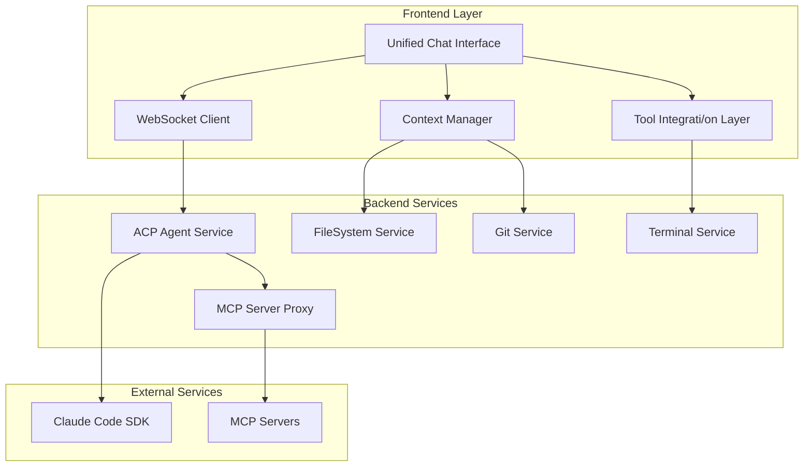

# Design Document

## Overview

The ACP Claude Code UI Unification transforms the current fragmented interface into a unified, chat-first experience that matches Claude Code's feature parity while maintaining the established neobrutalist design system. The design consolidates multiple scattered panels into a cohesive workspace centered around conversational AI interaction with integrated development tools.

The core architectural principle is **progressive disclosure** - starting with a clean chat interface that intelligently surfaces relevant tools and context as needed, rather than overwhelming users with multiple panels upfront. This approach reduces cognitive load while maintaining full functionality access.

## Architecture

### High-Level System Architecture



### Component Architecture

The unified interface follows a modular component architecture with clear separation of concerns:

1. **Chat Core**: Primary conversation interface with message threading
2. **Context Panel**: Collapsible sidebar for @-mentions and context management
3. **Tool Integration**: Inline tool execution and result display
4. **Session Manager**: Background session state and history management
5. **Connection Manager**: Unified authentication and connection handling

### State Management Strategy

```typescript
interface UnifiedAppState {
  // Chat state
  conversations: Map<string, Conversation>
  activeConversationId: string | null
  
  // Context state
  availableContext: ContextItem[]
  selectedContext: ContextItem[]
  
  // Connection state
  acpConnection: ConnectionState
  authStatus: AuthStatus
  
  // Tool state
  activeTools: Map<string, ToolExecution>
  mcpServers: Map<string, MCPServerStatus>
  
  // UI state
  sidebarCollapsed: boolean
  contextPanelOpen: boolean
  activeView: 'chat' | 'settings' | 'history'
}
```

## Components and Interfaces

### 1. Unified Chat Interface (`UnifiedChatInterface`)

**Purpose**: Primary interaction surface replacing all current panels

**Key Features**:
- Message threading with proper conversation flow
- Rich message rendering (code blocks, diffs, images)
- Inline tool execution results
- Real-time typing indicators and status updates
- Message actions (copy, retry, edit)

**Component Structure**:
```typescript
interface UnifiedChatInterface {
  // Core chat functionality
  messages: Message[]
  onSendMessage: (content: MessageContent) => void
  onRetryMessage: (messageId: string) => void
  
  // Context integration
  contextItems: ContextItem[]
  onAddContext: (item: ContextItem) => void
  
  // Tool integration
  toolExecutions: ToolExecution[]
  onExecuteTool: (tool: ToolCall) => void
  
  // UI state
  isLoading: boolean
  connectionStatus: ConnectionStatus
}
```

### 2. Smart Context Manager (`ContextManager`)

**Purpose**: Intelligent context discovery and management

**Key Features**:
- Auto-discovery of relevant files, git changes, terminal output
- @-mention autocomplete with fuzzy search
- Context preview and validation
- Smart context suggestions based on conversation

**Interface**:
```typescript
interface ContextManager {
  // Context discovery
  discoverContext: (query: string) => Promise<ContextItem[]>
  searchFiles: (pattern: string) => Promise<FileContextItem[]>
  getGitContext: () => Promise<GitContextItem[]>
  getTerminalContext: () => Promise<TerminalContextItem[]>
  
  // Context management
  addContext: (item: ContextItem) => void
  removeContext: (itemId: string) => void
  validateContext: (item: ContextItem) => Promise<boolean>
}
```

### 3. Integrated Tool Executor (`ToolExecutor`)

**Purpose**: Seamless tool execution within chat flow

**Key Features**:
- Inline command execution with real-time output
- File editing with diff preview and approval
- Terminal session management
- MCP tool integration with permission handling

**Interface**:
```typescript
interface ToolExecutor {
  // Command execution
  executeCommand: (command: string, options?: ExecutionOptions) => Promise<ExecutionResult>
  
  // File operations
  previewFileChanges: (changes: FileChange[]) => Promise<DiffPreview>
  applyFileChanges: (changes: FileChange[]) => Promise<ApplyResult>
  
  // Terminal management
  createTerminalSession: () => Promise<TerminalSession>
  sendToTerminal: (sessionId: string, input: string) => void
  
  // MCP integration
  callMCPTool: (serverId: string, toolName: string, params: any) => Promise<any>
}
```

### 4. Session State Manager (`SessionManager`)

**Purpose**: Conversation history and state persistence

**Key Features**:
- Conversation threading and branching
- Session export/import
- Context preservation across sessions
- Conversation search and filtering

**Interface**:
```typescript
interface SessionManager {
  // Session management
  createSession: (options?: SessionOptions) => Promise<Session>
  loadSession: (sessionId: string) => Promise<Session>
  saveSession: (session: Session) => Promise<void>
  
  // History management
  getConversationHistory: (filters?: HistoryFilters) => Promise<Conversation[]>
  searchConversations: (query: string) => Promise<SearchResult[]>
  
  // Export/import
  exportSession: (sessionId: string) => Promise<ExportData>
  importSession: (data: ExportData) => Promise<Session>
}
```

### 5. Connection Orchestrator (`ConnectionOrchestrator`)

**Purpose**: Unified authentication and connection management

**Key Features**:
- Streamlined authentication flow
- Connection health monitoring
- Automatic reconnection with state recovery
- Multi-workspace support

**Interface**:
```typescript
interface ConnectionOrchestrator {
  // Authentication
  authenticate: (method: AuthMethod) => Promise<AuthResult>
  refreshAuth: () => Promise<void>
  
  // Connection management
  connect: (config: ConnectionConfig) => Promise<void>
  disconnect: () => Promise<void>
  getConnectionStatus: () => ConnectionStatus
  
  // Health monitoring
  onConnectionChange: (callback: (status: ConnectionStatus) => void) => void
  ping: () => Promise<boolean>
}
```

## Data Models

### Core Message Types

```typescript
interface Message {
  id: string
  type: 'user' | 'assistant' | 'system' | 'tool_result'
  content: MessageContent[]
  timestamp: Date
  sessionId: string
  parentId?: string
  metadata?: MessageMetadata
}

interface MessageContent {
  type: 'text' | 'code' | 'image' | 'diff' | 'tool_execution'
  data: any
  metadata?: ContentMetadata
}

interface ToolExecution {
  id: string
  toolName: string
  status: 'pending' | 'running' | 'completed' | 'failed'
  input: any
  output?: any
  error?: string
  startTime: Date
  endTime?: Date
}
```

### Context Management Types

```typescript
interface ContextItem {
  id: string
  type: 'file' | 'folder' | 'git_diff' | 'terminal' | 'problems' | 'custom'
  label: string
  path?: string
  content?: string
  metadata?: ContextMetadata
}

interface FileContextItem extends ContextItem {
  type: 'file'
  path: string
  language?: string
  size: number
  lastModified: Date
}

interface GitContextItem extends ContextItem {
  type: 'git_diff'
  changes: GitChange[]
  branch: string
  commit?: string
}
```

### Session and Conversation Types

```typescript
interface Session {
  id: string
  title: string
  createdAt: Date
  lastActivity: Date
  workspace: string
  conversations: Conversation[]
  context: ContextItem[]
  settings: SessionSettings
}

interface Conversation {
  id: string
  messages: Message[]
  branch?: string
  metadata: ConversationMetadata
}
```

## Error Handling

### Error Classification and Recovery

1. **Connection Errors**
   - Auto-retry with exponential backoff
   - Offline mode with request queuing
   - Clear user feedback with recovery actions

2. **Authentication Errors**
   - Graceful auth renewal
   - Clear re-authentication prompts
   - Session state preservation during auth flows

3. **Tool Execution Errors**
   - Detailed error messages with context
   - Retry mechanisms for transient failures
   - Fallback options for failed operations

4. **Context Loading Errors**
   - Partial context loading with warnings
   - Alternative context suggestions
   - Manual context override options

### Error UI Patterns

```typescript
interface ErrorState {
  type: 'connection' | 'auth' | 'tool' | 'context' | 'unknown'
  message: string
  details?: string
  recoveryActions: RecoveryAction[]
  canRetry: boolean
}

interface RecoveryAction {
  label: string
  action: () => Promise<void>
  primary?: boolean
}
```

## Testing Strategy

### Component Testing Approach

1. **Unit Tests**: Core logic and utilities
   - Message parsing and formatting
   - Context discovery algorithms
   - State management reducers
   - Tool execution handlers

2. **Integration Tests**: Component interactions
   - Chat interface with context manager
   - Tool executor with WebSocket services
   - Session manager with persistence layer
   - Connection orchestrator with auth flows

3. **End-to-End Tests**: User workflows
   - Complete conversation flows
   - Context addition and usage
   - Tool execution and result handling
   - Session management and persistence

### Testing Infrastructure

```typescript
// Mock services for testing
interface MockServices {
  acpAgent: MockACPAgent
  fileSystem: MockFileSystemService
  git: MockGitService
  terminal: MockTerminalService
}

// Test utilities
interface TestUtils {
  createMockSession: () => Session
  createMockMessage: (type: MessageType) => Message
  simulateUserInput: (input: string) => void
  waitForResponse: () => Promise<Message>
}
```

### Performance Testing

1. **Message Rendering Performance**
   - Large conversation handling
   - Code block syntax highlighting
   - Image and media rendering

2. **Context Loading Performance**
   - Large file handling
   - Directory tree traversal
   - Git history processing

3. **Real-time Updates**
   - WebSocket message handling
   - UI update batching
   - Memory usage optimization

## Implementation Phases

### Phase 1: Core Chat Interface (Weeks 1-2)
- Basic chat UI with message threading
- WebSocket integration for real-time communication
- Simple text message handling
- Connection status indicators

### Phase 2: Context Management (Weeks 3-4)
- @-mention system implementation
- File and folder context integration
- Git diff context support
- Context preview and validation

### Phase 3: Tool Integration (Weeks 5-6)
- Inline command execution
- File editing with diff preview
- Terminal session management
- Basic MCP tool support

### Phase 4: Advanced Features (Weeks 7-8)
- Session management and persistence
- Conversation history and search
- Advanced MCP server integration
- Performance optimization

### Phase 5: Polish and Testing (Weeks 9-10)
- Comprehensive testing suite
- Accessibility improvements
- Performance optimization
- Documentation and user guides

## Migration Strategy

### Gradual Migration Approach

1. **Parallel Implementation**: Build new unified interface alongside existing panels
2. **Feature Parity**: Ensure all current functionality is available in new interface
3. **User Testing**: Gather feedback on new interface before full migration
4. **Gradual Rollout**: Provide toggle between old and new interfaces
5. **Complete Migration**: Remove old panels once new interface is stable

### Data Migration

- Preserve existing session data and preferences
- Migrate conversation history to new format
- Maintain backward compatibility for configuration files
- Provide import tools for existing workflows

### User Communication

- Clear migration timeline and benefits
- Training materials and documentation
- Support for users during transition
- Feedback collection and iteration based on user input