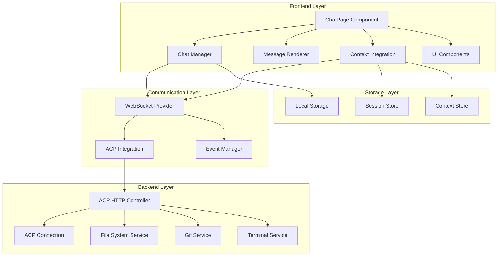

# Design Document

## Overview

The enhanced chatbot interface will transform the existing basic ChatPage.tsx into a sophisticated AI-powered development assistant. The design leverages the existing WebSocket infrastructure, ACP integration, and neobrutalist design system while introducing advanced features for rich content rendering, context management, and intelligent development assistance.

The architecture follows a modular approach with clear separation of concerns, maintaining compatibility with the existing cotg-cli ecosystem while providing extensible foundations for future enhancements.

## Architecture

### High-Level Architecture



### Component Architecture

The enhanced chatbot follows a component-based architecture with the following key modules:

1. **ChatPage Component**: Main orchestrator managing state and user interactions
2. **Message System**: Handles message rendering, streaming, and rich content
3. **Context Manager**: Manages file context, workspace integration, and AI context
4. **Session Manager**: Handles conversation sessions, persistence, and recovery
5. **AI Integration**: Interfaces with ACP system for advanced AI capabilities
6. **UI Components**: Reusable components following neobrutalist design patterns

## Components and Interfaces

### Core Interfaces

```typescript
// Enhanced message types supporting rich content
interface ChatMessage {
  id: string;
  role: 'user' | 'assistant' | 'system';
  content: MessageContent[];
  timestamp: number;
  sessionId?: string;
  metadata?: MessageMetadata;
}

interface MessageContent {
  type: 'text' | 'code' | 'file' | 'image' | 'diff' | 'terminal' | 'interactive';
  data: any;
  metadata?: ContentMetadata;
}

interface MessageMetadata {
  streaming?: boolean;
  tokens?: number;
  model?: string;
  context?: ContextReference[];
  actions?: MessageAction[];
}

// Context management for file and workspace integration
interface ContextItem {
  id: string;
  type: 'file' | 'directory' | 'git-diff' | 'terminal-output' | 'error';
  path: string;
  content?: string;
  metadata: ContextMetadata;
  preview?: string;
}

interface ContextMetadata {
  size?: number;
  lastModified?: number;
  language?: string;
  encoding?: string;
  gitStatus?: 'modified' | 'added' | 'deleted' | 'untracked';
}

// Session management for conversation organization
interface ChatSession {
  id: string;
  name: string;
  topic?: string;
  created: number;
  lastActivity: number;
  messageCount: number;
  context: ContextItem[];
  settings: SessionSettings;
}

interface SessionSettings {
  model?: string;
  temperature?: number;
  maxTokens?: number;
  systemPrompt?: string;
  autoContext?: boolean;
}
```

### Component Specifications

#### 1. Enhanced ChatPage Component

**Location**: `src/webview/react-frontend/src/pages/ChatPage.tsx`

**Responsibilities**:
- Main state management and user interaction handling
- Integration with WebSocket provider and ACP system
- Session management and persistence
- Context coordination between components

**Key Features**:
- Multi-session support with session switching
- Real-time message streaming with typing indicators
- Context panel for file and workspace integration
- Settings panel for customization
- Responsive design with mobile optimization

#### 2. Message Renderer System

**Location**: `src/webview/react-frontend/src/components/chat/`

**Components**:
- `MessageRenderer.tsx`: Main message rendering component
- `CodeBlock.tsx`: Syntax-highlighted code rendering with copy functionality
- `FileReference.tsx`: Interactive file references with preview
- `DiffViewer.tsx`: Git diff visualization with apply functionality
- `TerminalOutput.tsx`: Terminal output rendering with ANSI support
- `InteractiveContent.tsx`: Interactive elements like buttons and forms

**Key Features**:
- Markdown rendering with custom extensions
- Syntax highlighting for 100+ languages
- Interactive code blocks with copy, edit, and apply actions
- File preview with lazy loading
- Streaming content support with progressive rendering

#### 3. Context Management System

**Location**: `src/webview/react-frontend/src/components/context/`

**Components**:
- `ContextPanel.tsx`: Main context management interface
- `FileExplorer.tsx`: Workspace file browser with search
- `GitIntegration.tsx`: Git status and diff integration
- `MentionSuggestions.tsx`: @file mention autocomplete
- `ContextPreview.tsx`: Context item preview and management

**Key Features**:
- Drag-and-drop file addition
- @mention autocomplete with fuzzy search
- Git integration for changed files
- Context size management and optimization
- Preview generation for various file types

#### 4. Session Management System

**Location**: `src/webview/react-frontend/src/components/sessions/`

**Components**:
- `SessionManager.tsx`: Session creation, switching, and management
- `SessionList.tsx`: Session browser with search and filtering
- `SessionSettings.tsx`: Per-session configuration
- `ConversationExport.tsx`: Export functionality for conversations

**Key Features**:
- Automatic session creation and topic detection
- Session search and filtering
- Conversation export in multiple formats
- Session recovery and backup
- Cross-session context sharing

#### 5. AI Integration Layer

**Location**: `src/webview/react-frontend/src/components/ai/`

**Components**:
- `AiProvider.tsx`: ACP integration and AI model management
- `ModelSelector.tsx`: AI model selection and configuration
- `StreamingHandler.tsx`: Real-time response streaming
- `PermissionManager.tsx`: AI permission request handling

**Key Features**:
- Multiple AI model support
- Real-time streaming with cancellation
- Permission request handling
- Context-aware AI interactions
- Model-specific optimizations

### UI Component Library Extensions

#### Enhanced Button Component

Extends the existing button component with chatbot-specific variants:

```typescript
// Additional button variants for chatbot interface
type ChatBotVariant = 'message-action' | 'context-add' | 'session-switch' | 'ai-stop';

interface EnhancedButtonProps extends ButtonProps {
  chatVariant?: ChatBotVariant;
  streaming?: boolean;
  contextCount?: number;
}
```

#### Message Bubble Component

New component for message rendering with neobrutalist styling:

```typescript
interface MessageBubbleProps {
  role: 'user' | 'assistant' | 'system';
  children: React.ReactNode;
  streaming?: boolean;
  actions?: MessageAction[];
  timestamp: number;
  avatar?: React.ReactNode;
}
```

#### Context Item Component

Component for displaying context items with preview:

```typescript
interface ContextItemProps {
  item: ContextItem;
  onRemove?: () => void;
  onPreview?: () => void;
  compact?: boolean;
}
```

## Data Models

### Message Storage Schema

```typescript
// Local storage schema for message persistence
interface StoredMessage {
  id: string;
  sessionId: string;
  role: string;
  content: string; // Serialized MessageContent[]
  timestamp: number;
  metadata?: string; // Serialized MessageMetadata
}

// Session storage schema
interface StoredSession {
  id: string;
  name: string;
  topic?: string;
  created: number;
  lastActivity: number;
  messageCount: number;
  settings: string; // Serialized SessionSettings
}

// Context storage schema
interface StoredContext {
  sessionId: string;
  items: string; // Serialized ContextItem[]
  lastUpdated: number;
}
```

### WebSocket Message Protocol Extensions

```typescript
// Extended WebSocket message types for enhanced chatbot
interface ChatWebSocketMessage {
  type: 'chat_message' | 'chat_stream' | 'chat_context' | 'chat_session' | 'chat_ai';
  id?: string;
  sessionId?: string;
  data: any;
  timestamp?: number;
}

// Streaming message protocol
interface StreamingMessage {
  type: 'chat_stream';
  messageId: string;
  chunk: string;
  done: boolean;
  metadata?: {
    tokens?: number;
    model?: string;
  };
}

// Context update protocol
interface ContextMessage {
  type: 'chat_context';
  sessionId: string;
  action: 'add' | 'remove' | 'update';
  items: ContextItem[];
}
```

## Error Handling

### Error Categories and Handling Strategies

#### 1. Connection Errors
- **WebSocket disconnection**: Graceful degradation with offline mode
- **ACP connection failure**: Fallback to basic chat functionality
- **Network timeouts**: Retry logic with exponential backoff

#### 2. AI Integration Errors
- **Model unavailable**: Automatic fallback to available models
- **Rate limiting**: Queue management with user notification
- **Authentication errors**: Clear error messages with re-auth flow

#### 3. Context Errors
- **File access denied**: Skip inaccessible files with notification
- **Large file handling**: Automatic truncation with user consent
- **Git integration failures**: Graceful fallback to manual file selection

#### 4. Storage Errors
- **LocalStorage quota exceeded**: Automatic cleanup of old sessions
- **Serialization errors**: Data validation and recovery mechanisms
- **Corruption detection**: Backup and restore functionality

### Error Recovery Mechanisms

```typescript
// Error boundary for chat components
class ChatErrorBoundary extends React.Component {
  // Handles component-level errors with graceful fallbacks
}

// Connection recovery service
class ConnectionRecovery {
  // Manages WebSocket reconnection and state restoration
}

// Data integrity service
class DataIntegrityService {
  // Validates and repairs corrupted local storage data
}
```

## Testing Strategy

### Unit Testing Approach

Following the project's manual testing preference, unit tests will be minimal and focused on critical functionality:

1. **Message Parsing**: Test message content parsing and serialization
2. **Context Management**: Test file context addition and removal
3. **Session Management**: Test session creation and switching logic
4. **WebSocket Integration**: Test message sending and receiving
5. **Error Handling**: Test error recovery mechanisms

### Integration Testing

Manual integration testing will focus on:

1. **End-to-End Workflows**: Complete conversation flows with context
2. **ACP Integration**: AI model switching and advanced features
3. **File System Integration**: File context and workspace integration
4. **Cross-Browser Compatibility**: Testing on different browsers and devices
5. **Performance Testing**: Large conversation and context handling

### Testing Components

```typescript
// Test utilities for manual testing
interface TestScenario {
  name: string;
  description: string;
  steps: string[];
  expectedResults: string[];
}

// Mock data generators for testing
class ChatTestData {
  static generateMessages(count: number): ChatMessage[];
  static generateSessions(count: number): ChatSession[];
  static generateContext(fileCount: number): ContextItem[];
}
```

### Performance Testing Considerations

1. **Message Rendering Performance**: Test with 1000+ messages
2. **Context Loading**: Test with large files and many context items
3. **Memory Usage**: Monitor memory consumption during long sessions
4. **Streaming Performance**: Test real-time message streaming
5. **Mobile Performance**: Test on low-end mobile devices

## Implementation Notes

### Neobrutalist Design Integration

The enhanced chatbot will fully embrace the existing neobrutalist design system:

1. **Bold Borders**: All components use thick, black borders
2. **Sharp Shadows**: Consistent shadow patterns for depth
3. **High Contrast**: Strong color contrasts for accessibility
4. **Geometric Shapes**: Rectangular, angular design elements
5. **Bold Typography**: Strong, readable fonts with clear hierarchy

### Accessibility Considerations

1. **Screen Reader Support**: Proper ARIA labels and semantic HTML
2. **Keyboard Navigation**: Full keyboard accessibility for all features
3. **High Contrast Mode**: Support for high contrast themes
4. **Motion Preferences**: Respect reduced motion preferences
5. **Font Scaling**: Support for user font size preferences

### Performance Optimizations

1. **Virtual Scrolling**: For large message lists
2. **Lazy Loading**: For context previews and file content
3. **Message Chunking**: Efficient rendering of long conversations
4. **Context Caching**: Smart caching of file content and previews
5. **WebSocket Optimization**: Efficient message batching and compression

### Security Considerations

1. **File Access Control**: Restrict file access to workspace boundaries
2. **Content Sanitization**: Sanitize all user-generated content
3. **XSS Prevention**: Proper escaping of dynamic content
4. **CSRF Protection**: Secure WebSocket communication
5. **Data Privacy**: Local storage encryption for sensitive data