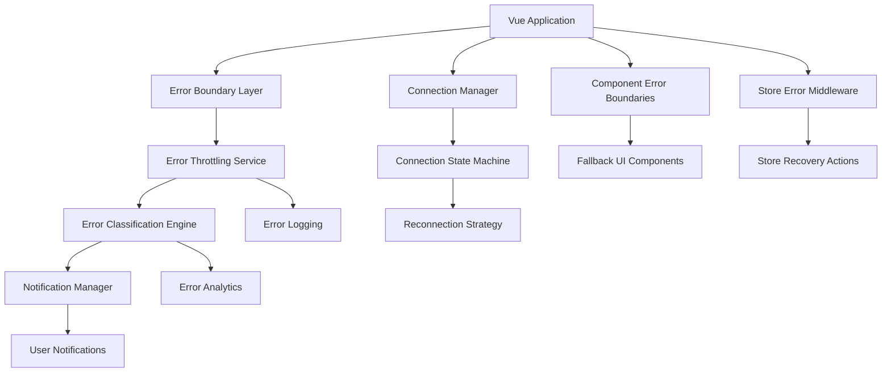
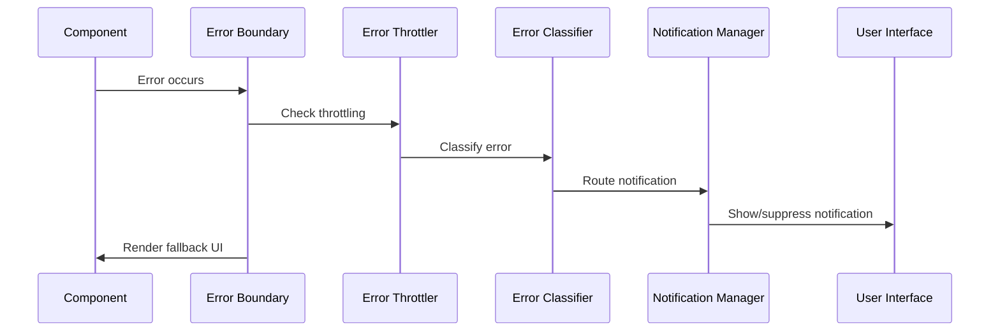

# Design Document

## Overview

This design addresses the infinite notification loop issue in the VS Code extension's Vue.js frontend by implementing a comprehensive error handling system with intelligent throttling, proper connection management, and graceful degradation patterns. The solution focuses on preventing error cascades while maintaining robust error reporting and user experience.

## Architecture

### High-Level Architecture



### Error Handling Flow



## Components and Interfaces

### 1. Error Throttling Service

**Purpose:** Prevent duplicate notifications and implement intelligent error suppression.

```typescript
interface ErrorThrottlingConfig {
  maxErrorsPerWindow: number
  timeWindowMs: number
  suppressDuplicates: boolean
  exponentialBackoff: boolean
}

interface ErrorThrottler {
  shouldShowError(errorKey: string, severity: ErrorSeverity): boolean
  recordError(errorKey: string, timestamp: number): void
  resetThrottling(errorKey?: string): void
  getErrorStats(): ErrorStats
}
```

**Key Features:**
- Time-based error windows
- Exponential backoff for repeated errors
- Error fingerprinting for deduplication
- Configurable thresholds per error category

### 2. Connection State Manager

**Purpose:** Manage WebSocket connections with proper state tracking and recovery.

```typescript
interface ConnectionState {
  status: 'disconnected' | 'connecting' | 'connected' | 'reconnecting' | 'error'
  autoConnect: boolean
  retryCount: number
  maxRetries: number
  lastError?: string
  connectionTime?: Date
}

interface ConnectionManager {
  connect(url: string, options?: ConnectionOptions): Promise<void>
  disconnect(): void
  getState(): ConnectionState
  setAutoConnect(enabled: boolean): void
  resetRetryCount(): void
}
```

**Key Features:**
- Manual connection control (no auto-connect)
- Exponential backoff with jitter
- Connection health monitoring
- Graceful degradation support

### 3. Error Classification Engine

**Purpose:** Categorize errors by severity and determine appropriate handling.

```typescript
enum ErrorSeverity {
  LOW = 'low',        // Log only, no notification
  MEDIUM = 'medium',  // Throttled notification
  HIGH = 'high',      // Immediate notification
  CRITICAL = 'critical' // Persistent notification + recovery
}

interface ErrorClassifier {
  classifyError(error: Error | AppError): ErrorClassification
  registerPattern(pattern: ErrorPattern): void
  updateSeverity(errorType: string, severity: ErrorSeverity): void
}
```

**Classification Rules:**
- Network errors: MEDIUM (throttled)
- Component errors: LOW (logged only)
- Store errors: MEDIUM (throttled)
- Critical system errors: HIGH (immediate)
- Security errors: CRITICAL (persistent)

### 4. Component Error Boundaries

**Purpose:** Contain component failures and provide fallback UI.

```typescript
interface ErrorBoundaryProps {
  fallbackComponent?: Component
  onError?: (error: Error, errorInfo: ErrorInfo) => void
  resetOnPropsChange?: boolean
  isolateErrors?: boolean
}

interface FallbackUIProps {
  error: Error
  retry: () => void
  reset: () => void
  canRecover: boolean
}
```

**Implementation Strategy:**
- Wrap critical components in error boundaries
- Provide contextual fallback UI
- Enable error recovery actions
- Prevent error propagation to parent components

### 5. Notification Manager

**Purpose:** Centralized notification system with intelligent display logic.

```typescript
interface NotificationManager {
  show(notification: AppNotification): string
  dismiss(id: string): void
  dismissAll(): void
  configure(config: NotificationConfig): void
  getActive(): AppNotification[]
}

interface AppNotification {
  id: string
  type: 'info' | 'warning' | 'error' | 'success'
  title: string
  message: string
  actions?: NotificationAction[]
  persistent?: boolean
  timeout?: number
}
```

**Features:**
- Notification queuing and prioritization
- Auto-dismiss for non-critical notifications
- Action buttons for recovery
- Notification history and analytics

## Data Models

### Error Models

```typescript
interface AppError extends Error {
  id: string
  category: ErrorCategory
  severity: ErrorSeverity
  timestamp: Date
  context: ErrorContext
  fingerprint: string
  recoveryActions?: ErrorRecoveryAction[]
}

interface ErrorContext {
  component?: string
  store?: string
  action?: string
  userId?: string
  sessionId: string
  buildVersion: string
  environment: string
  userAgent: string
  url: string
  additionalData?: Record<string, any>
}

interface ErrorRecoveryAction {
  id: string
  label: string
  action: () => Promise<void>
  type: 'retry' | 'reset' | 'reload' | 'custom'
}
```

### Connection Models

```typescript
interface ConnectionOptions {
  timeout: number
  retryDelay: number
  maxRetries: number
  enableHeartbeat: boolean
  heartbeatInterval: number
}

interface ConnectionEvent {
  type: 'connect' | 'disconnect' | 'error' | 'message' | 'heartbeat'
  timestamp: Date
  data?: any
  error?: Error
}
```

### Store Models

```typescript
interface StoreErrorContext {
  storeName: string
  actionName: string
  payload?: any
  previousState?: any
  currentState?: any
}

interface StoreRecoveryState {
  canRollback: boolean
  rollbackState?: any
  retryAction?: () => Promise<void>
}
```

## Error Handling

### Error Prevention Strategies

1. **Input Validation**
   - Validate all user inputs before processing
   - Sanitize data before store operations
   - Type checking for API responses

2. **Defensive Programming**
   - Null/undefined checks
   - Try-catch blocks around async operations
   - Graceful handling of missing dependencies

3. **Circuit Breaker Pattern**
   - Disable failing services temporarily
   - Automatic recovery after cooldown period
   - Fallback functionality for critical features

### Error Recovery Mechanisms

1. **Component Recovery**
   ```typescript
   const ErrorBoundary = {
     data() {
       return { hasError: false, error: null }
     },
     errorCaptured(error, instance, info) {
       this.hasError = true
       this.error = error
       // Log error without triggering notifications
       return false
     },
     methods: {
       retry() {
         this.hasError = false
         this.error = null
         this.$forceUpdate()
       }
     }
   }
   ```

2. **Store Recovery**
   ```typescript
   const storeErrorMiddleware = {
     onError(error, store, action) {
       // Log error
       console.error(`Store error in ${store}.${action}:`, error)
       
       // Attempt recovery
       if (canRecover(error)) {
         return recoverStore(store, action)
       }
       
       // Fallback to previous state
       return rollbackState(store)
     }
   }
   ```

3. **Connection Recovery**
   ```typescript
   class ConnectionRecovery {
     async recover() {
       // Reset connection state
       this.resetConnection()
       
       // Clear error flags
       this.hasShownConnectionError = false
       
       // Attempt reconnection with backoff
       return this.connectWithBackoff()
     }
   }
   ```

## Testing Strategy

### Unit Testing

1. **Error Throttling Tests**
   - Test throttling logic with various time windows
   - Verify error deduplication
   - Test exponential backoff calculations

2. **Connection Manager Tests**
   - Test connection state transitions
   - Verify retry logic and backoff
   - Test manual connection control

3. **Error Classification Tests**
   - Test error pattern matching
   - Verify severity assignment
   - Test classification rule updates

### Integration Testing

1. **Error Boundary Integration**
   - Test error containment
   - Verify fallback UI rendering
   - Test error recovery actions

2. **Store Error Handling**
   - Test store error middleware
   - Verify error recovery mechanisms
   - Test state rollback functionality

3. **Notification System**
   - Test notification throttling
   - Verify notification prioritization
   - Test auto-dismiss functionality

### End-to-End Testing

1. **Error Scenarios**
   - Simulate network failures
   - Test component error handling
   - Verify user experience during errors

2. **Recovery Scenarios**
   - Test error recovery actions
   - Verify application stability after errors
   - Test connection recovery

### Manual Testing

1. **User Experience Testing**
   - Verify no infinite notifications
   - Test error message clarity
   - Validate recovery action effectiveness

2. **Performance Testing**
   - Monitor error handling overhead
   - Test memory usage during errors
   - Verify application responsiveness

## Implementation Phases

### Phase 1: Core Error Infrastructure
- Implement error throttling service
- Create error classification engine
- Set up notification manager
- Update error handler configuration

### Phase 2: Connection Management
- Implement connection state manager
- Add manual connection controls
- Create connection recovery mechanisms
- Update WebSocket service

### Phase 3: Component Error Boundaries
- Create error boundary components
- Implement fallback UI components
- Add error recovery actions
- Wrap critical components

### Phase 4: Store Error Handling
- Implement store error middleware
- Add store recovery mechanisms
- Create state rollback functionality
- Update store configurations

### Phase 5: Testing and Validation
- Implement comprehensive test suite
- Perform integration testing
- Conduct user experience testing
- Validate performance impact

## Security Considerations

1. **Error Information Disclosure**
   - Sanitize error messages for production
   - Avoid exposing sensitive data in errors
   - Implement secure error reporting

2. **Error Injection Prevention**
   - Validate error inputs
   - Prevent malicious error triggering
   - Secure error recovery actions

3. **Connection Security**
   - Validate WebSocket connections
   - Implement connection authentication
   - Secure error transmission

## Performance Considerations

1. **Error Handling Overhead**
   - Minimize error processing time
   - Use efficient error deduplication
   - Optimize notification rendering

2. **Memory Management**
   - Limit error history storage
   - Clean up error contexts
   - Prevent memory leaks in error handlers

3. **Network Optimization**
   - Batch error reports
   - Compress error data
   - Implement efficient retry strategies

## Monitoring and Analytics

1. **Error Metrics**
   - Track error frequency and types
   - Monitor error recovery success rates
   - Measure user experience impact

2. **Performance Metrics**
   - Monitor error handling performance
   - Track notification system efficiency
   - Measure connection stability

3. **User Experience Metrics**
   - Track user interactions with error notifications
   - Monitor error recovery usage
   - Measure application stability perception