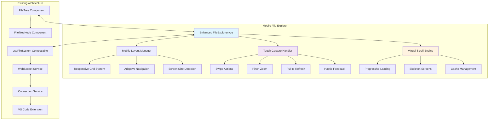

# Design Document

## Overview

The Mobile File Explorer design enhances the existing Vue.js FileExplorer component with mobile-first principles, advanced touch interactions, and responsive design patterns. The design leverages the current WebSocket architecture, useFileSystem composable, and component structure while adding mobile-specific enhancements like gesture recognition, virtual scrolling optimizations, progressive loading, and adaptive layouts that provide an optimal experience across all device types.

## Architecture

### High-Level Architecture



### Component Enhancement Strategy

```
Enhanced FileExplorer.vue
├── Mobile Layout Manager
│   ├── ResponsiveGrid (handles breakpoints)
│   ├── AdaptiveHeader (collapsible search/actions)
│   └── MobileNavigation (bottom sheet navigation)
├── Touch Gesture System
│   ├── SwipeGestureHandler (file actions)
│   ├── PinchZoomHandler (density control)
│   ├── PullRefreshHandler (refresh trigger)
│   └── HapticFeedback (native feedback)
├── Enhanced Virtual Scrolling
│   ├── ProgressiveLoader (lazy loading)
│   ├── SkeletonRenderer (loading states)
│   └── CacheManager (offline support)
└── Mobile File Preview
    ├── ImagePreview (zoom/pan)
    ├── CodePreview (syntax highlighting)
    └── MarkdownPreview (rendered view)
```

## Components and Interfaces

### Enhanced FileExplorer Component

**Purpose**: Main file explorer with mobile-first enhancements built on existing architecture

**Key Enhancements**:
- Responsive breakpoint management with CSS Grid and Flexbox
- Touch gesture recognition using Hammer.js or native touch events
- Progressive loading with intersection observer
- Mobile-optimized context menus and action sheets
- Haptic feedback integration for supported devices

**Enhanced Props Interface**:
```typescript
interface MobileFileExplorerProps extends FileExplorerProps {
  // Mobile-specific props
  touchEnabled?: boolean
  gesturesEnabled?: boolean
  hapticFeedback?: boolean
  virtualScrolling?: boolean
  progressiveLoading?: boolean
  
  // Layout props
  mobileLayout?: 'list' | 'grid' | 'compact'
  tabletLayout?: 'sidebar' | 'overlay' | 'split'
  desktopLayout?: 'three-column' | 'two-column'
  
  // Performance props
  itemsPerPage?: number
  preloadDistance?: number
  cacheSize?: number
}
```

### Mobile Layout Manager

**Purpose**: Handles responsive layout transitions and breakpoint management

**Key Features**:
- CSS Grid-based responsive system with container queries
- Smooth transitions between layout modes
- State preservation during layout changes
- Orientation change handling
- Safe area support for notched devices

**Layout Configuration Interface**:
```typescript
interface LayoutConfiguration {
  breakpoints: {
    mobile: number    // < 768px
    tablet: number    // 768px - 1024px
    desktop: number   // > 1024px
  }
  
  layouts: {
    mobile: {
      columns: 1
      itemHeight: number
      padding: string
      touchTargetSize: number
    }
    tablet: {
      columns: 2 | 'auto'
      sidebarWidth: number
      collapsible: boolean
    }
    desktop: {
      columns: 3 | 'auto'
      maxWidth: number
      gridGap: string
    }
  }
  
  animations: {
    layoutTransition: string
    itemTransition: string
    orientationChange: string
  }
}
```

### Touch Gesture Handler

**Purpose**: Manages touch interactions and gesture recognition

**Key Features**:
- Swipe-to-reveal file actions (delete, rename, share)
- Pinch-to-zoom for adjusting file list density
- Pull-to-refresh with elastic animation
- Long-press for context menus
- Two-finger navigation gestures

**Gesture Interface**:
```typescript
interface GestureConfiguration {
  swipe: {
    threshold: number
    velocity: number
    actions: {
      left: GestureAction[]
      right: GestureAction[]
      up: GestureAction
      down: GestureAction
    }
  }
  
  pinch: {
    minScale: number
    maxScale: number
    scaleStep: number
    centerPoint: 'cursor' | 'center'
  }
  
  pullRefresh: {
    threshold: number
    maxDistance: number
    elasticity: number
    hapticTrigger: boolean
  }
  
  longPress: {
    duration: number
    tolerance: number
    hapticFeedback: boolean
  }
}

interface GestureAction {
  type: 'delete' | 'rename' | 'share' | 'preview' | 'select'
  icon: string
  color: string
  haptic?: 'light' | 'medium' | 'heavy'
  confirmRequired?: boolean
}
```

### Enhanced Virtual Scrolling System

**Purpose**: Optimized virtual scrolling with mobile-specific enhancements

**Key Features**:
- Progressive loading with intersection observer
- Skeleton screen rendering during load states
- Smart caching with LRU eviction
- Smooth scroll momentum preservation
- Dynamic item height calculation

**Virtual Scroll Configuration**:
```typescript
interface VirtualScrollConfig {
  // Performance settings
  itemHeight: number | 'dynamic'
  overscan: number
  threshold: number
  
  // Progressive loading
  pageSize: number
  preloadPages: number
  loadingStrategy: 'eager' | 'lazy' | 'intersection'
  
  // Caching
  cacheSize: number
  cacheTTL: number
  persistCache: boolean
  
  // Mobile optimizations
  momentum: boolean
  snapToItems: boolean
  rubberBanding: boolean
}

interface VirtualScrollState {
  visibleRange: { start: number; end: number }
  scrollTop: number
  isScrolling: boolean
  loadingItems: Set<number>
  cachedItems: Map<string, FileSystemNode>
  skeletonCount: number
}
```

### Mobile File Preview System

**Purpose**: Enhanced file preview with mobile-optimized interactions

**Key Features**:
- Full-screen image preview with pinch-zoom and pan
- Syntax-highlighted code preview with line numbers
- Rendered markdown preview with scroll sync
- Swipe navigation between files
- Share integration with native APIs

**Preview Interface**:
```typescript
interface FilePreviewConfig {
  // Image preview
  image: {
    maxZoom: number
    minZoom: number
    doubleTapZoom: number
    panEnabled: boolean
    rotationEnabled: boolean
  }
  
  // Code preview
  code: {
    syntaxHighlighting: boolean
    lineNumbers: boolean
    wordWrap: boolean
    fontSize: 'small' | 'medium' | 'large'
    theme: 'light' | 'dark' | 'auto'
  }
  
  // Markdown preview
  markdown: {
    renderMath: boolean
    renderMermaid: boolean
    linkHandling: 'internal' | 'external' | 'ask'
    scrollSync: boolean
  }
  
  // Navigation
  swipeNavigation: boolean
  keyboardNavigation: boolean
  shareEnabled: boolean
}
```

## Data Models

### Enhanced File System State

```typescript
interface MobileFileSystemState extends FileTreeState {
  // Mobile-specific state
  layout: {
    currentBreakpoint: 'mobile' | 'tablet' | 'desktop'
    orientation: 'portrait' | 'landscape'
    safeArea: { top: number; bottom: number; left: number; right: number }
    viewportSize: { width: number; height: number }
  }
  
  // Touch interaction state
  gestures: {
    activeGesture: string | null
    swipeActions: Map<string, GestureAction[]>
    pinchScale: number
    pullRefreshState: 'idle' | 'pulling' | 'refreshing' | 'complete'
  }
  
  // Performance state
  virtualScroll: VirtualScrollState
  cache: {
    items: Map<string, FileSystemNode>
    previews: Map<string, FilePreview>
    thumbnails: Map<string, string>
  }
  
  // Accessibility state
  accessibility: {
    screenReaderEnabled: boolean
    reducedMotion: boolean
    highContrast: boolean
    fontSize: 'small' | 'medium' | 'large' | 'xlarge'
  }
}
```

### Mobile-Optimized WebSocket Messages

```typescript
interface MobileWebSocketMessage extends WebSocketMessage {
  // Mobile-specific message types
  type: 'command' | 'response' | 'broadcast' | 'status' | 
        'mobile-gesture' | 'mobile-layout' | 'mobile-preview'
  
  // Enhanced data payloads
  data?: {
    // Gesture data
    gestureData?: {
      type: string
      target: string
      coordinates: { x: number; y: number }
      velocity?: { x: number; y: number }
      scale?: number
    }
    
    // Layout data
    layoutData?: {
      breakpoint: string
      orientation: string
      safeArea: any
      preferences: any
    }
    
    // Preview data
    previewData?: {
      path: string
      type: 'image' | 'code' | 'markdown'
      content: string
      metadata: any
    }
  }
}
```

## Error Handling

### Mobile-Specific Error Scenarios

**Touch Interaction Errors**:
- Gesture recognition failures with fallback to standard interactions
- Haptic feedback unavailability with silent degradation
- Touch event conflicts with scroll behavior resolution

**Layout and Responsive Errors**:
- Breakpoint detection failures with safe defaults
- Orientation change handling with state preservation
- Safe area calculation errors with standard padding fallback

**Performance and Loading Errors**:
- Virtual scroll calculation errors with standard scrolling fallback
- Progressive loading failures with full data loading
- Cache corruption with automatic cache clearing and rebuild

## Performance Considerations

### Mobile-Specific Optimizations

**Touch Performance**:
- Passive event listeners for scroll and touch events
- RequestAnimationFrame for smooth gesture animations
- Touch action CSS properties for preventing default behaviors
- Hardware acceleration for transform-based animations

**Memory Management**:
- Aggressive cache eviction on memory pressure
- Image lazy loading with intersection observer
- Component recycling in virtual scroll
- Automatic cleanup of event listeners and observers

**Network Optimization**:
- Progressive image loading with low-quality placeholders
- Request debouncing for rapid user interactions
- Offline-first caching strategy with service worker
- Compression for WebSocket messages

## Security Considerations

### Mobile Security Enhancements

**Touch Security**:
- Touch jacking protection with frame-ancestors CSP
- Gesture validation to prevent injection attacks
- Secure handling of haptic feedback permissions

**File Access Security**:
- Enhanced path validation for mobile file operations
- Secure file preview with sandboxed rendering
- Safe handling of file sharing with permission checks

## Testing Strategy

### Mobile Testing Approach

Following the project's manual testing guidelines with mobile focus:

1. **Device Testing Matrix**
   - iOS Safari (iPhone 12+, iPad)
   - Android Chrome (Pixel, Samsung Galaxy)
   - Mobile Firefox and Edge
   - Various screen sizes and orientations


2. **Responsive Design Testing**
   - Layout adaptation across breakpoints
   - Orientation change handling
   - Safe area respect on notched devices
   - Text scaling and accessibility features

## Implementation Phases

### Phase 1: Core Mobile Layout
- Responsive breakpoint system implementation
- Basic touch gesture recognition
- Mobile-optimized file list layout
- Enhanced virtual scrolling

### Phase 2: Advanced Touch Interactions
- Swipe-to-reveal actions implementation
- Pinch-to-zoom functionality
- Pull-to-refresh mechanism
- Haptic feedback integration

### Phase 3: File Preview System
- Mobile-optimized image preview
- Code preview with syntax highlighting
- Markdown rendering with navigation
- Share functionality integration

### Phase 4: Performance and Polish
- Progressive loading optimization
- Cache management enhancement
- Accessibility improvements
- Animation and transition refinement

### Phase 5: Integration and Testing
- WebSocket integration testing
- Cross-device compatibility verification
- Performance optimization
- User experience refinement