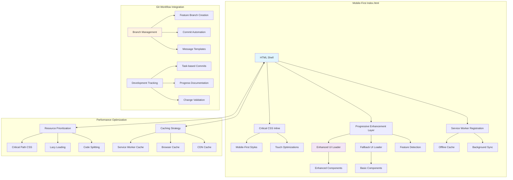
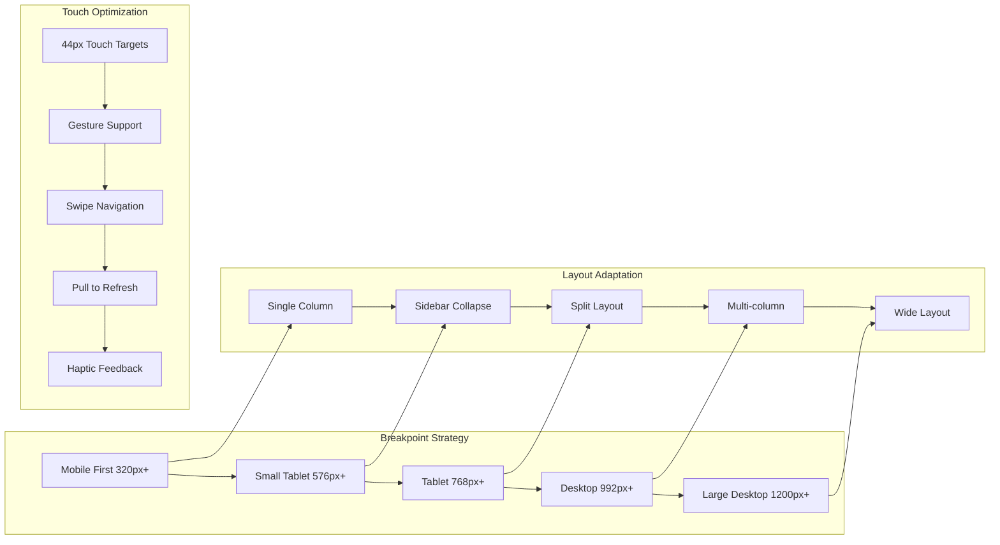

# Design Document

## Overview

The Mobile-First Index Optimization design transforms the existing `src/webview/frontend/index.html` into a highly optimized, mobile-first web application that seamlessly integrates with the enhanced UI components. The design emphasizes progressive enhancement, performance optimization, and comprehensive git workflow management throughout the development process. The solution implements modern web standards, accessibility features, and progressive web app capabilities while maintaining backward compatibility.

## Architecture

### High-Level Architecture



### Mobile-First Responsive Architecture



## Components and Interfaces

### HTML Shell Structure

**Purpose**: Optimized HTML foundation with mobile-first approach and progressive enhancement

**Key Features**:
- Semantic HTML5 structure with proper accessibility markup
- Critical CSS inlined for immediate rendering
- Progressive enhancement with feature detection
- Service worker registration for offline functionality
- Meta tags optimized for mobile devices and PWA

**HTML Structure**:
```html
<!DOCTYPE html>
<html lang="en" class="no-js">
<head>
    <!-- Critical meta tags for mobile optimization -->
    <meta charset="UTF-8">
    <meta name="viewport" content="width=device-width, initial-scale=1.0, user-scalable=no">
    <meta name="theme-color" content="#1e1e1e">
    <meta name="mobile-web-app-capable" content="yes">
    
    <!-- PWA manifest and icons -->
    <link rel="manifest" href="./manifest.json">
    <link rel="icon" type="image/svg+xml" href="./icons/icon.svg">
    
    <!-- Critical CSS inlined -->
    <style>/* Critical mobile-first CSS */</style>
    
    <!-- Preload critical resources -->
    <link rel="preload" href="./js/enhanced.js" as="script">
    <link rel="preload" href="./fonts/codicon.woff2" as="font" type="font/woff2" crossorigin>
</head>
<body>
    <!-- App shell with progressive enhancement -->
    <div id="app" class="app-container">
        <!-- Loading screen -->
        <div id="loadingScreen" class="loading-screen">
            <div class="loading-spinner" aria-label="Loading application"></div>
            <div class="loading-text">Initializing...</div>
        </div>
        
        <!-- Fallback content for no-JS users -->
        <noscript>
            <div class="no-js-fallback">
                <h1>JavaScript Required</h1>
                <p>This application requires JavaScript to function properly.</p>
            </div>
        </noscript>
    </div>
    
    <!-- Progressive enhancement scripts -->
    <script>/* Feature detection and UI loader */</script>
</body>
</html>
```

### Progressive Enhancement System

**Purpose**: Intelligent loading system that adapts to device capabilities and network conditions

**Key Features**:
- Feature detection for enhanced UI capabilities
- Network-aware resource loading
- Graceful degradation to basic UI when needed
- Performance monitoring and adaptive loading
- Error recovery and fallback mechanisms

**Enhancement Interface**:
```typescript
interface ProgressiveEnhancement {
    // Device capability detection
    capabilities: {
        touchSupport: boolean;
        highDPI: boolean;
        webGL: boolean;
        serviceWorker: boolean;
        intersectionObserver: boolean;
        resizeObserver: boolean;
    };
    
    // Network conditions
    network: {
        effectiveType: '2g' | '3g' | '4g' | 'slow-2g';
        downlink: number;
        rtt: number;
        saveData: boolean;
    };
    
    // Loading strategy
    loadingStrategy: {
        useEnhancedUI: boolean;
        lazyLoadImages: boolean;
        preloadCritical: boolean;
        enableAnimations: boolean;
    };
    
    // Performance metrics
    performance: {
        firstContentfulPaint: number;
        largestContentfulPaint: number;
        cumulativeLayoutShift: number;
        firstInputDelay: number;
    };
}
```

### Mobile-First CSS Architecture

**Purpose**: Optimized CSS delivery with mobile-first responsive design

**Key Features**:
- Critical CSS inlined for immediate rendering
- Progressive CSS loading for enhanced features
- CSS custom properties for theming
- Container queries for component-level responsiveness
- Touch-optimized interactions and animations

**CSS Structure**:
```css
/* Critical mobile-first styles (inlined) */
:root {
    /* CSS custom properties for theming */
    --primary-color: #007acc;
    --background-color: #1e1e1e;
    --text-color: #cccccc;
    --touch-target-size: 44px;
    --border-radius: 4px;
    --animation-duration: 0.2s;
}

/* Mobile-first base styles */
* {
    box-sizing: border-box;
    -webkit-tap-highlight-color: transparent;
}

body {
    margin: 0;
    padding: 0;
    font-family: -apple-system, BlinkMacSystemFont, 'Segoe UI', Roboto, sans-serif;
    font-size: 16px; /* Minimum readable size on mobile */
    line-height: 1.5;
    background: var(--background-color);
    color: var(--text-color);
    overflow-x: hidden;
}

/* Touch-optimized interactive elements */
button, .interactive {
    min-height: var(--touch-target-size);
    min-width: var(--touch-target-size);
    padding: 12px 16px;
    border: none;
    border-radius: var(--border-radius);
    cursor: pointer;
    transition: all var(--animation-duration) ease;
}

/* Responsive breakpoints */
@media (min-width: 576px) { /* Small tablets */ }
@media (min-width: 768px) { /* Tablets */ }
@media (min-width: 992px) { /* Desktop */ }
@media (min-width: 1200px) { /* Large desktop */ }

/* Container queries for component responsiveness */
@container (min-width: 400px) {
    .sidebar { transform: translateX(0); }
}
```

### Service Worker Integration

**Purpose**: Offline functionality and performance optimization through intelligent caching

**Key Features**:
- Offline-first caching strategy
- Background synchronization
- Push notification support
- Cache versioning and invalidation
- Network-first for dynamic content, cache-first for static assets

**Service Worker Interface**:
```typescript
interface ServiceWorkerStrategy {
    // Caching strategies
    cacheStrategies: {
        static: 'cache-first';
        api: 'network-first';
        images: 'cache-first';
        fonts: 'cache-first';
    };
    
    // Cache configuration
    caches: {
        static: {
            name: 'static-v1';
            maxAge: 86400; // 24 hours
            maxEntries: 100;
        };
        dynamic: {
            name: 'dynamic-v1';
            maxAge: 3600; // 1 hour
            maxEntries: 50;
        };
    };
    
    // Background sync
    backgroundSync: {
        enabled: boolean;
        syncTags: string[];
        maxRetries: number;
    };
    
    // Push notifications
    pushNotifications: {
        enabled: boolean;
        vapidKey: string;
        subscriptionEndpoint: string;
    };
}
```

## Data Models

### Mobile-First Configuration

```typescript
interface MobileFirstConfig {
    // Viewport configuration
    viewport: {
        width: 'device-width';
        initialScale: 1.0;
        maximumScale: 5.0;
        userScalable: boolean;
        viewportFit: 'cover' | 'contain' | 'auto';
    };
    
    // Touch configuration
    touch: {
        targetSize: number; // Minimum 44px
        gestureSupport: boolean;
        hapticFeedback: boolean;
        swipeThreshold: number;
    };
    
    // Performance configuration
    performance: {
        criticalCSSSize: number; // Max 14KB
        lazyLoadThreshold: number;
        imageOptimization: boolean;
        preloadCritical: boolean;
    };
    
    // Accessibility configuration
    accessibility: {
        highContrast: boolean;
        reducedMotion: boolean;
        screenReader: boolean;
        keyboardNavigation: boolean;
    };
}
```

### Git Workflow Configuration

```typescript
interface GitWorkflowConfig {
    // Branch management
    branches: {
        feature: string; // feature/mobile-first-index-optimization
        base: string; // main or dev
        naming: string; // Convention for branch names
    };
    
    // Commit configuration
    commits: {
        conventional: boolean; // Use conventional commit format
        template: string; // Commit message template
        signOff: boolean; // Add sign-off to commits
        gpgSign: boolean; // GPG sign commits
    };
    
    // Task tracking
    tasks: {
        prefix: string; // Task prefix in commit messages
        linkIssues: boolean; // Link to issue numbers
        progressTracking: boolean; // Track implementation progress
    };
    
    // Quality gates
    qualityGates: {
        linting: boolean; // Run linter before commit
        testing: boolean; // Run tests before commit
        buildCheck: boolean; // Verify build before commit
    };
}
```

### Performance Monitoring

```typescript
interface PerformanceMetrics {
    // Core Web Vitals
    coreWebVitals: {
        firstContentfulPaint: number;
        largestContentfulPaint: number;
        firstInputDelay: number;
        cumulativeLayoutShift: number;
    };
    
    // Custom metrics
    customMetrics: {
        timeToInteractive: number;
        totalBlockingTime: number;
        speedIndex: number;
        resourceLoadTime: number;
    };
    
    // Mobile-specific metrics
    mobileMetrics: {
        touchResponseTime: number;
        scrollPerformance: number;
        batteryUsage: number;
        memoryUsage: number;
    };
    
    // Network metrics
    networkMetrics: {
        connectionType: string;
        effectiveType: string;
        downlink: number;
        rtt: number;
    };
}
```

## Error Handling

### Progressive Enhancement Fallbacks

- **Enhanced UI Failure**: Automatic fallback to basic UI with user notification
- **Service Worker Failure**: Graceful degradation to standard caching
- **Network Failure**: Offline mode with cached content and sync queue
- **JavaScript Errors**: Error boundaries with recovery options

### Mobile-Specific Error Handling

- **Touch Event Failures**: Fallback to click events with visual feedback
- **Orientation Change Issues**: Layout recalculation and state preservation
- **Memory Constraints**: Automatic cleanup and resource optimization
- **Battery Optimization**: Reduced animations and background activity

### Git Workflow Error Recovery

- **Commit Failures**: Automatic retry with conflict resolution
- **Branch Issues**: Automatic branch creation and switching
- **Merge Conflicts**: Visual conflict resolution interface
- **Network Issues**: Offline commit queue with sync on reconnection

## Testing Strategy

### Manual Testing Approach

Following the project's testing guidelines, comprehensive manual testing will focus on:

1. **Mobile Device Testing**
   - Test on actual mobile devices (iOS Safari, Android Chrome)
   - Verify touch interactions and gesture support
   - Test different screen sizes and orientations
   - Validate performance on low-end devices

2. **Progressive Enhancement Testing**
   - Test enhanced UI loading and fallback scenarios
   - Verify graceful degradation when features are unavailable
   - Test offline functionality and service worker behavior
   - Validate error recovery and user feedback

3. **Performance Testing**
   - Measure Core Web Vitals on mobile devices
   - Test loading performance on slow networks
   - Verify memory usage and battery impact
   - Test caching effectiveness and offline behavior

4. **Accessibility Testing**
   - Test with screen readers (VoiceOver, TalkBack)
   - Verify keyboard navigation and focus management
   - Test high contrast mode and text scaling
   - Validate ARIA labels and semantic markup

5. **Git Workflow Testing**
   - Verify branch creation and management
   - Test commit automation and message formatting
   - Validate task tracking and progress documentation
   - Test conflict resolution and error recovery

## Implementation Phases

### Phase 1: HTML Shell and Critical CSS
- Create optimized HTML structure with semantic markup
- Implement critical CSS with mobile-first approach
- Add progressive enhancement detection
- Set up service worker registration

### Phase 2: Progressive Enhancement System
- Implement feature detection and capability assessment
- Create enhanced UI loader with fallback mechanisms
- Add performance monitoring and adaptive loading
- Implement error handling and recovery

### Phase 3: Mobile Optimization
- Optimize touch interactions and gesture support
- Implement responsive design with container queries
- Add PWA features and offline functionality
- Optimize performance for mobile devices

### Phase 4: Git Workflow Integration
- Set up automated branch management
- Implement commit automation with conventional messages
- Add task tracking and progress documentation
- Create quality gates and validation

### Phase 5: Testing and Optimization
- Comprehensive manual testing across devices
- Performance optimization and Core Web Vitals improvement
- Accessibility testing and compliance
- Final integration and deployment preparation

## Security Considerations

### Content Security Policy

```html
<meta http-equiv="Content-Security-Policy" 
      content="default-src 'self'; 
               style-src 'self' 'unsafe-inline'; 
               script-src 'self' 'unsafe-inline'; 
               connect-src 'self' ws: wss:; 
               img-src 'self' data: https:; 
               font-src 'self' data:;">
```

### Input Validation and Sanitization

- Sanitize all user input before processing
- Validate WebSocket messages and data
- Implement XSS protection for dynamic content
- Use secure storage for sensitive data

### Network Security

- Enforce HTTPS for all external resources
- Implement proper CORS policies
- Use secure WebSocket connections (WSS)
- Validate all API responses and data

## Performance Targets

### Core Web Vitals Goals

- **First Contentful Paint**: < 1.8 seconds
- **Largest Contentful Paint**: < 2.5 seconds
- **First Input Delay**: < 100 milliseconds
- **Cumulative Layout Shift**: < 0.1

### Mobile Performance Goals

- **Time to Interactive**: < 3.8 seconds on 3G
- **Total Blocking Time**: < 200 milliseconds
- **Speed Index**: < 3.4 seconds
- **Bundle Size**: < 250KB compressed

### Accessibility Goals

- **WCAG 2.1 AA Compliance**: 100%
- **Keyboard Navigation**: Full support
- **Screen Reader Compatibility**: VoiceOver, NVDA, JAWS
- **Color Contrast**: Minimum 4.5:1 ratio