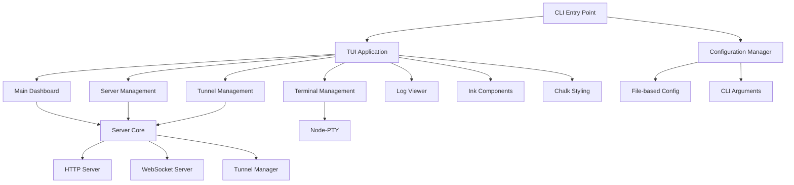

# Design Document

## Overview

This design document outlines the architecture for migrating the VS Code extension-based web automation tunnel to a standalone Terminal User Interface (TUI) application. The migration will preserve all existing functionality while replacing VS Code-specific APIs with Node.js native equivalents and modern TUI libraries.

## Architecture

### High-Level Architecture



### Core Components Migration

#### 1. Entry Point Migration
- **From:** VS Code extension activation
- **To:** CLI application with commander.js
- **Changes:** Replace `activate()` function with CLI argument parsing and TUI initialization

#### 2. Configuration System Migration
- **From:** VS Code workspace configuration
- **To:** File-based configuration with CLI overrides
- **Location:** `~/.kiro-tunnel/config.json` or project-local `.kiro-tunnel/config.json`
- **Format:** JSON with schema validation

#### 3. UI System Migration
- **From:** VS Code webview with React frontend
- **To:** Terminal UI with Ink components
- **Components:** Dashboard, forms, status displays, log viewers

#### 4. Terminal System Migration
- **From:** VS Code PseudoTerminal API
- **To:** node-pty with TUI integration
- **Features:** Multiple terminal tabs, session persistence, output streaming

## Components and Interfaces

### 1. CLI Application Structure

```typescript
// src/cli/index.ts
interface CLIOptions {
  config?: string;
  port?: number;
  debug?: boolean;
  logLevel?: 'debug' | 'info' | 'warn' | 'error';
}

interface TUIApplication {
  start(options: CLIOptions): Promise<void>;
  stop(): Promise<void>;
  restart(): Promise<void>;
}
```

### 2. Configuration Manager

```typescript
// src/config/ConfigManager.ts
interface TUIConfig {
  server: {
    httpPort: number;
    websocketPort?: number;
    autoStart: boolean;
  };
  tunnel: {
    autoStartTunnel: boolean;
    defaultTunnelName?: string;
    cloudflareToken?: string;
  };
  terminal: {
    engineMode: 'auto' | 'line' | 'pipe';
    injectAICredentials: boolean;
    debug: boolean;
  };
  ui: {
    theme: 'dark' | 'light';
    refreshInterval: number;
    logLevel: string;
  };
}

class ConfigManager {
  loadConfig(): Promise<TUIConfig>;
  saveConfig(config: TUIConfig): Promise<void>;
  watchConfig(callback: (config: TUIConfig) => void): void;
  migrateFromVSCode(): Promise<TUIConfig>;
}
```

### 3. TUI Components Architecture

```typescript
// src/tui/components/
interface TUIComponent {
  render(): React.ReactElement;
  handleInput(input: string): void;
  onFocus(): void;
  onBlur(): void;
}

// Main Dashboard Component
class Dashboard extends TUIComponent {
  // Server status, tunnel status, quick actions
}

// Server Management Component
class ServerManager extends TUIComponent {
  // Start/stop servers, view logs, configuration
}

// Tunnel Management Component
class TunnelManager extends TUIComponent {
  // Create/stop tunnels, view status, manage credentials
}

// Terminal Component
class TerminalManager extends TUIComponent {
  // Multiple terminal tabs, session management
}
```

### 4. Server Core Migration

The existing server core (HTTP, WebSocket, Tunnel management) will be preserved with minimal changes:

```typescript
// src/server/ServerCore.ts - Migrated from ServerManager
class ServerCore {
  // Remove VS Code dependencies
  // Replace vscode.window.showInformationMessage with TUI notifications
  // Replace vscode.workspace.getConfiguration with ConfigManager
  // Replace vscode.ExtensionContext with custom context
}
```

### 5. Terminal Integration

```typescript
// src/terminal/PTYManager.ts
interface PTYSession {
  id: string;
  pty: NodePty.IPty;
  title: string;
  cwd: string;
  active: boolean;
}

class PTYManager {
  createSession(options: PTYOptions): PTYSession;
  destroySession(id: string): void;
  writeToSession(id: string, data: string): void;
  resizeSession(id: string, cols: number, rows: number): void;
  listSessions(): PTYSession[];
}
```

## Data Models

### 1. Application State

```typescript
interface ApplicationState {
  servers: {
    http: ServerStatus;
    websocket: ServerStatus;
  };
  tunnels: TunnelStatus[];
  terminals: PTYSession[];
  config: TUIConfig;
  logs: LogEntry[];
}

interface ServerStatus {
  isRunning: boolean;
  port: number;
  uptime?: number;
  connections: number;
  lastError?: string;
}

interface TunnelStatus {
  id: string;
  name?: string;
  isRunning: boolean;
  publicUrl?: string;
  localUrl: string;
  startTime?: Date;
  type: 'quick' | 'named';
}
```

### 2. Configuration Schema

```json
{
  "$schema": "http://json-schema.org/draft-07/schema#",
  "type": "object",
  "properties": {
    "server": {
      "type": "object",
      "properties": {
        "httpPort": { "type": "number", "minimum": 1024, "maximum": 65535 },
        "autoStart": { "type": "boolean" }
      }
    },
    "tunnel": {
      "type": "object",
      "properties": {
        "autoStartTunnel": { "type": "boolean" },
        "defaultTunnelName": { "type": "string" }
      }
    }
  }
}
```

## Error Handling

### 1. TUI Error Display

```typescript
// src/tui/components/ErrorDisplay.ts
interface ErrorDisplayProps {
  error: Error;
  onDismiss: () => void;
  onRetry?: () => void;
}

class ErrorDisplay extends TUIComponent {
  // Display errors in modal overlays
  // Provide action buttons (Dismiss, Retry, View Details)
  // Support error categorization and severity levels
}
```

### 2. Graceful Degradation

- Network errors: Show offline mode with cached status
- Configuration errors: Provide inline editing and validation
- Server startup errors: Offer port alternatives and diagnostics
- Terminal errors: Fallback to basic command execution

## Testing Strategy

### 1. Unit Testing

```typescript
// Tests for each migrated component
describe('ConfigManager', () => {
  it('should load configuration from file');
  it('should migrate VS Code settings');
  it('should validate configuration schema');
});

describe('PTYManager', () => {
  it('should create terminal sessions');
  it('should handle session cleanup');
  it('should manage multiple sessions');
});
```

### 2. Integration Testing

```typescript
// Test TUI interactions
describe('TUI Integration', () => {
  it('should start application with default config');
  it('should handle keyboard navigation');
  it('should update display on state changes');
});

// Test server functionality without VS Code
describe('Server Integration', () => {
  it('should start HTTP server independently');
  it('should handle WebSocket connections');
  it('should manage tunnel lifecycle');
});
```

### 3. Manual Testing

- Cross-platform terminal compatibility
- Keyboard shortcuts and navigation
- Real-time status updates
- Error handling and recovery
- Configuration migration from VS Code

## Implementation Phases

### Phase 1: Core Infrastructure
1. Set up CLI application structure
2. Implement configuration management
3. Create basic TUI framework
4. Migrate server core without VS Code dependencies

### Phase 2: TUI Components
1. Implement main dashboard
2. Create server management interface
3. Build tunnel management interface
4. Add configuration editor

### Phase 3: Terminal Integration
1. Integrate node-pty
2. Implement terminal manager
3. Add session persistence
4. Create terminal UI components

### Phase 4: Polish and Testing
1. Add comprehensive error handling
2. Implement logging and debugging
3. Create installation and packaging
4. Add VS Code configuration migration

## File Structure Changes

### Files to Remove
- `src/extension.ts` - VS Code extension entry point
- `src/webview/provider.ts` - VS Code webview provider
- `src/webview/panel.html` - HTML webview content
- `src/commands/buttonCommands.ts` - VS Code command handlers
- `src/integration-test.ts` - VS Code-specific integration tests
- `package.json` VS Code extension metadata

### Files to Modify
- `src/server/ServerManager.ts` → `src/server/ServerCore.ts`
- `src/server/pseudo/KiroPseudoTerminal.ts` → `src/terminal/PTYManager.ts`
- `src/server/ConfigurationManager.ts` → `src/config/ConfigManager.ts`

### Files to Add
```
src/
├── cli/
│   ├── index.ts              # CLI entry point
│   └── commands.ts           # CLI command definitions
├── tui/
│   ├── App.tsx              # Main TUI application
│   ├── components/
│   │   ├── Dashboard.tsx    # Main dashboard
│   │   ├── ServerManager.tsx
│   │   ├── TunnelManager.tsx
│   │   ├── TerminalManager.tsx
│   │   └── ConfigEditor.tsx
│   └── hooks/
│       ├── useServerState.ts
│       └── useTunnelState.ts
├── config/
│   ├── ConfigManager.ts     # File-based configuration
│   ├── schema.json          # Configuration schema
│   └── migration.ts         # VS Code migration utilities
├── terminal/
│   ├── PTYManager.ts        # node-pty integration
│   └── SessionManager.ts    # Terminal session management
└── utils/
    ├── logger.ts            # Logging utilities
    └── notifications.ts     # TUI notifications
```

## Dependencies

### New Dependencies
```json
{
  "dependencies": {
    "ink": "^4.4.1",
    "react": "^18.2.0",
    "chalk": "^5.3.0",
    "commander": "^11.1.0",
    "node-pty": "^1.0.0",
    "chokidar": "^3.5.3",
    "ajv": "^8.12.0",
    "conf": "^11.0.2"
  }
}
```

### Dependencies to Remove
```json
{
  "devDependencies": {
    "@types/vscode": "^1.74.0"
  }
}
```

## Security Considerations

1. **Configuration Security**: Encrypt sensitive tokens in configuration files
2. **Terminal Security**: Validate and sanitize terminal input/output
3. **Network Security**: Maintain existing CORS and security headers
4. **File System Security**: Validate file paths and permissions
5. **Process Security**: Properly manage child processes and cleanup

## Performance Considerations

1. **TUI Rendering**: Optimize React component updates for terminal rendering
2. **Memory Management**: Implement proper cleanup for terminal sessions
3. **Network Efficiency**: Maintain existing WebSocket optimization
4. **Startup Time**: Lazy load components and services
5. **Resource Usage**: Monitor and limit terminal session resources

## Accessibility

1. **Keyboard Navigation**: Full keyboard support for all TUI components
2. **Screen Reader Support**: Proper ARIA labels and descriptions
3. **Color Accessibility**: Support for high contrast and colorblind users
4. **Text Scaling**: Respect terminal font size settings
5. **Alternative Interfaces**: Provide CLI-only mode for automation