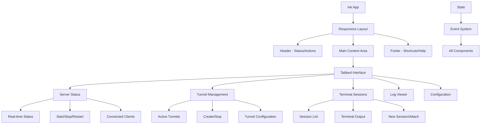

# Design Document

## Overview

This design migrates the existing VS Code extension-based "Web Automation Tunnel" into a standalone CLI + TUI application while preserving the current server/tunnel features. We will remove direct dependencies on the VS Code API, introduce a CLI entrypoint, and add a terminal UX powered by Commander (CLI), Ink (TUI), and Chalk (styling). Terminal execution migrates from VS Code's PseudoTerminal to node-pty (with a robust fallback to the existing pseudo line/pipe engine).

## Architecture

### High‑Level Architecture

```mermaid
graph TB
    CLI[CLI Entry Point] --> TUI[TUI Shell]
    CLI --> Config[Configuration Manager]
    CLI --> Core[Server Core]

    TUI --> Dashboard[Main Dashboard]
    TUI --> ServerMgmt[Server Management]
    TUI --> TunnelMgmt[Tunnel Management]
    TUI --> TerminalMgmt[Terminal Sessions]
    TUI --> LogViewer[Log Viewer]

    Dashboard --> Core
    ServerMgmt --> Core
    TunnelMgmt --> Core
    TerminalMgmt --> PTY[PTY Layer]

    Core --> HTTP[HTTP Server]
    Core --> WS[WebSocket Server]
    Core --> CF[Cloudflare Tunnels]

    PTY --> NodePTY[node-pty]
    PTY --> Fallback[SessionEngine (line/pipe)]

    Config --> FileConfig[File-based Config]
    Config --> CLIArgs[CLI Overrides]

    TUI --> Ink[Ink Components]
    TUI --> Chalk[Chalk Styling]
    TUI --> React[React for TUI]
```

### Enhanced TUI Architecture



### Core Components Migration

1) Entry Point
- From: `activate()` in VS Code extension
- To: `src/cli/index.ts` using `commander` with subcommands (`start`, `stop`, `status`, `tunnel`, `term`)

2) Configuration
- From: `vscode.workspace.getConfiguration('webAutomationTunnel')` and `.remote-coding/config.json`
- To: file-based config loaded by `src/config/ConfigManager.ts` with CLI overrides; supports global (`~/.kiro-remote/config.json`) and project (`.kiro-remote/config.json`) levels; JSON schema validation via `ajv`.

3) UI System
- From: VS Code webview React app and commands
- To: Ink-based TUI (dashboard + detail panes) with Chalk for text emphasis and clear error output. A CLI-only mode prints concise status to stdout with chalked formatting.

4) Terminal
- From: VS Code `Pseudoterminal` (`KiroPseudoTerminal`) and pseudo line/pipe engine
- To: node-pty as primary PTY backend. If node-pty not loadable (no native binary), fall back to the existing `SessionEngine` (line/pipe). Sessions are renderable inside the TUI and also controllable via WebSocket protocol.

5) Events/Notifications
- From: `vscode.EventEmitter`, `window.showInformationMessage`/`showErrorMessage`
- To: Node `events.EventEmitter` for internal events, and CLI/TUI notifications via Chalk-rendered toasts in Ink or plain console output in CLI-only mode.

## API Migration Matrix

- VS Code: `vscode.window.showInformationMessage/WarningMessage/ErrorMessage`
  - CLI/TUI: logger + Ink toast; `chalk` for severity coloring

- VS Code: `vscode.workspace.getConfiguration`
  - CLI/TUI: `ConfigManager` (reads JSON); CLI flags override

- VS Code: `vscode.workspace.fs`, `FileSystemWatcher`
  - CLI/TUI: Node `fs` + `chokidar`

- VS Code: `vscode.commands.executeCommand`
  - CLI/TUI: replace with local `CommandRegistry`; for now, only TUI actions and host-OS helpers (open file in `$EDITOR`)

- VS Code: `Pseudoterminal`
  - CLI/TUI: `node-pty` via `PTYManager` with fallback to `SessionEngine`

- VS Code: `workspaceFolders`
  - CLI/TUI: `process.cwd()` or user-configured `root`

## Components and Interfaces

### 1) CLI Application Structure

```typescript
// src/cli/index.ts (outline)
interface CLIOptions {
  config?: string;
  port?: number;
  debug?: boolean;
  logLevel?: 'debug' | 'info' | 'warn' | 'error';
}

interface AppController {
  start(opts: CLIOptions): Promise<void>;
  stop(): Promise<void>;
  status(): Promise<void>;
}
```

### 2) Configuration Manager (CLI)

```typescript
// src/config/ConfigManager.ts (outline)
interface TUIConfig {
  server: { httpPort: number; websocketPort?: number; autoStart: boolean };
  tunnel: { autoStartTunnel: boolean; defaultTunnelName?: string; cloudflareToken?: string };
  terminal: { engineMode: 'auto' | 'line' | 'pipe'; injectAICredentials: boolean; debug: boolean };
  ui: { theme: 'dark' | 'light'; refreshInterval: number; logLevel: 'debug'|'info'|'warn'|'error' };
}
```

### 3) PTY Layer

```typescript
// src/terminal/PTYManager.ts (outline)
export function createPty(opts: { cwd: string; env: NodeJS.ProcessEnv; cols: number; rows: number; shell?: string; args?: string[] }) {
  // Try vendor node-pty first, fallback to require('node-pty'), else return null
}
```

## Migration‑Affected Files

### Remove (extension-only UI and activation)
- `src/extension.ts` - Main extension entry point with all VS Code command registrations
- `src/commands/buttonCommands.ts` - VS Code command palette integrations
- `src/commands/diagnosePTY.ts` - VS Code PTY diagnostics command
- `src/webview/provider.ts` - WebView provider for VS Code UI
- `src/webview/**` - WebView assets (React frontend served by HTTP server now)
- `src/integration-test.ts` - Extension-specific integration tests

### Refactor (remove VS Code runtime reliance)

#### High Priority (Core Server Components)
- `src/server/ServerManager.ts`
  - Remove all VS Code EventEmitters, replace with Node EventEmitter
  - Replace `vscode.window.showInformationMessage` with logger/TUI notifications
  - Remove VS Code configuration dependency, use ConfigManager
  - Remove status bar and quick pick functionality
  - Update error handling to work without VS Code UI

- `src/server/TerminalService.ts`
  - Already has optional VS Code support, enhance for CLI mode
  - Ensure node-pty integration works properly without VS Code fallback
  - Update workspace root detection for CLI environment

- `src/server/CloudflaredManager.ts`
  - Remove VS Code secret storage dependency
  - Implement file-based credential storage
  - Update extension context usage for CLI environment

- `src/server/ConfigurationManager.ts`
  - Remove VS Code workspace configuration entirely
  - Replace with file-based configuration system
  - Keep as legacy wrapper during migration

#### Medium Priority (Supporting Services)
- `src/server/ErrorHandler.ts`
  - Remove VS Code notification system
  - Implement file-based and console error logging
  - Add TUI-compatible error display

- `src/server/WebSocketServer.ts`
  - Update CommandHandler to work without VS Code commands
  - Implement CLI-safe command execution
  - Remove VS Code-specific error handling

- `src/server/pseudo/KiroPseudoTerminal.ts`
  - Keep as-is (implements VS Code Pseudoterminal interface)
  - Will only be used when running in VS Code extension mode

- `src/server/LocalTunnel.ts`
  - Remove VS Code-specific status displays
  - Update notification system for CLI compatibility

#### Low Priority (Utilities)
- `src/server/FileSystemService.ts` - Already uses Node.js APIs, minimal changes needed
- `src/server/GitService.ts` - Already uses Node.js APIs, minimal changes needed
- `src/server/ConnectionRecoveryManager.ts` - Already Node.js compatible
- `src/server/interfaces.ts` - Type definitions, no changes needed
- `src/server/index.ts` - Entry point, no VS Code dependencies

### Keep (Already CLI-Compatible)
- `src/cli/index.ts` - Commander-based CLI entrypoint (already implemented)
- `src/cli/controller.ts` - Server controller for CLI (already implemented)
- `src/config/ConfigManager.ts` - File-based configuration (already implemented)
- `src/terminal/PTYManager.ts` - node-pty integration (already implemented)
- `src/utils/logger.ts` - Chalk-based logger (already implemented)
- `src/server/pseudo/SessionEngine.ts` - Terminal session engine (CLI-compatible)

### Add (TUI Components and Enhanced Features)

#### TUI Framework Structure
- `src/tui/App.tsx` - Main Ink application component
- `src/tui/components/Layout.tsx` - Responsive layout component
- `src/tui/components/Header.tsx` - Status and actions header
- `src/tui/components/Footer.tsx` - Shortcuts and help footer
- `src/tui/components/TabView.tsx` - Tabbed navigation interface

#### Feature Components
- `src/tui/components/ServerTab.tsx` - Server status and controls
- `src/tui/components/TunnelTab.tsx` - Tunnel management interface
- `src/tui/components/TerminalTab.tsx` - Terminal session management
- `src/tui/components/LogsTab.tsx` - Log viewer with filtering
- `src/tui/components/ConfigTab.tsx` - Configuration editor

#### Supporting Components
- `src/tui/components/ServerStatus.tsx` - Real-time server status display
- `src/tui/components/TunnelList.tsx` - Active tunnels list
- `src/tui/components/TerminalView.tsx` - Terminal output display
- `src/tui/components/LogViewer.tsx` - Real-time log streaming
- `src/tui/components/Form.tsx` - Reusable form components

#### State Management
- `src/tui/state/` - State management directory
- `src/tui/state/AppState.ts` - Global application state
- `src/tui/state/ServerState.ts` - Server state management
- `src/tui/state/TunnelState.ts` - Tunnel state management
- `src/tui/state/TerminalState.ts` - Terminal session state

#### Hooks and Utilities
- `src/tui/hooks/` - Custom React hooks directory
- `src/tui/hooks/useServerState.ts` - Server state hook
- `src/tui/hooks/useTunnelState.ts` - Tunnel state hook
- `src/tui/hooks/useTerminalState.ts` - Terminal state hook
- `src/tui/utils/` - TUI-specific utilities
- `src/tui/utils/formatting.ts` - Text formatting utilities
- `src/tui/utils/navigation.ts` - Keyboard navigation helpers

## Runtime Compatibility Strategy

- Replace top-level `import 'vscode'` with one of:
  - lazy `require('vscode')` guarded by try/catch; or
  - `import type * as vscode from 'vscode'` and ensure no runtime access.
- Prefer Node EventEmitter for internal events. Keep VS Code emitters only in extension code-paths.
- Default roots/paths to `process.cwd()` when workspace is not available.

## Implementation Phases

1) Core Infrastructure
- Add CLI entrypoint + basic commands
- Introduce CLI `ConfigManager`
- Wire `HttpServer` + `WebSocketServer` without VS Code

2) Terminal Integration
- Implement `PTYManager` (vendor/node-pty → npm/node-pty → fallback `SessionEngine`)
- Add session persistence + resize handling in TUI

3) TUI Components
- Ink app shell + dashboard
- Server/tunnel/terminal panes
- Log viewer and error toasts

4) Polish & Distribution
- Structured logging, error surfaces
- Packaging as npm binary (add `bin` in package.json)
- Cross-platform validation

## Dependencies

New runtime deps: `commander`, `chalk`, `ink`, `react`, `chokidar`, `ajv`.

Optional: `node-pty` (best-effort install). The app also supports vendor-supplied prebuilt binaries and will gracefully fall back to pseudo mode if PTY cannot load.

## Accessibility & UX
- Full keyboard support in Ink
- High-contrast themes and minimal color reliance
- CLI-only mode for automation and headless environments

## Transition Strategy
- Keep extension files until CLI is feature-complete.
- Land refactors that make server modules VS Code-agnostic.
- Ship CLI first (binary via npm). Remove extension artifacts after final parity.

