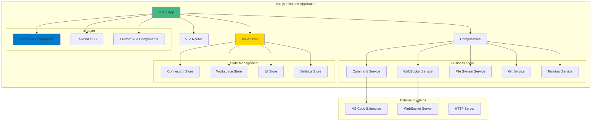

# Design Document

## Overview

The Vue.js Frontend Modernization transforms the existing vanilla JavaScript frontend into a modern, maintainable Vue.js 3 application. The new architecture leverages Vue 3's Composition API, Pinia for state management, Tailwind CSS for styling, and PrimeVue for UI components. The design maintains all existing functionality while providing better developer experience, improved performance, and enhanced user interface.

## Architecture

### High-Level Architecture



### Technology Stack

- **Framework**: Vue.js 3 with Composition API
- **Build Tool**: Vite for fast development and optimized builds
- **State Management**: Pinia for centralized state management
- **Routing**: Vue Router for single-page application navigation
- **Styling**: Tailwind CSS for utility-first styling
- **UI Components**: PrimeVue for rich component library
- **Language**: TypeScript for type safety
- **Linting**: ESLint + Vue ESLint plugin
- **Formatting**: Prettier for code formatting

## Components and Interfaces

### Core Application Structure

```
src/
├── main.ts                 # Application entry point
├── App.vue                 # Root component
├── router/
│   └── index.ts           # Vue Router configuration
├── stores/
│   ├── connection.ts      # WebSocket connection state
│   ├── workspace.ts       # VS Code workspace state
│   ├── ui.ts             # UI state and preferences
│   └── settings.ts       # Application settings
├── composables/
│   ├── useWebSocket.ts    # WebSocket connection logic
│   ├── useCommands.ts     # VS Code command execution
│   ├── useFileSystem.ts   # File system operations
│   ├── useGit.ts         # Git operations
│   └── useTerminal.ts    # Terminal functionality
├── components/
│   ├── layout/
│   │   ├── AppHeader.vue
│   │   ├── AppSidebar.vue
│   │   └── AppFooter.vue
│   ├── automation/
│   │   ├── CommandPanel.vue
│   │   ├── ServerStatus.vue
│   │   └── ConnectionInfo.vue
│   ├── files/
│   │   ├── FileExplorer.vue
│   │   ├── FileTree.vue
│   │   └── FileViewer.vue
│   ├── git/
│   │   ├── GitDashboard.vue
│   │   ├── BranchInfo.vue
│   │   ├── CommitHistory.vue
│   │   └── DiffViewer.vue
│   ├── terminal/
│   │   ├── TerminalPanel.vue
│   │   └── TerminalOutput.vue
│   ├── chat/
│   │   ├── ChatInterface.vue
│   │   ├── MessageHistory.vue
│   │   └── MessageInput.vue
│   └── common/
│       ├── LoadingSpinner.vue
│       ├── ErrorBoundary.vue
│       └── NotificationToast.vue
├── views/
│   ├── HomeView.vue
│   ├── AutomationView.vue
│   ├── FilesView.vue
│   ├── GitView.vue
│   ├── TerminalView.vue
│   └── ChatView.vue
├── services/
│   ├── websocket.ts       # WebSocket service implementation
│   ├── api.ts            # HTTP API service
│   └── storage.ts        # Local storage utilities
├── types/
│   ├── websocket.ts      # WebSocket message types
│   ├── workspace.ts      # Workspace state types
│   ├── git.ts           # Git operation types
│   └── common.ts        # Common type definitions
└── utils/
    ├── constants.ts      # Application constants
    ├── helpers.ts       # Utility functions
    └── validators.ts    # Input validation functions
```

### Key Composables Design

#### useWebSocket Composable

```typescript
interface WebSocketComposable {
  // State
  isConnected: Ref<boolean>
  connectionStatus: Ref<ConnectionStatus>
  lastMessage: Ref<WebSocketMessage | null>
  
  // Methods
  connect: (url: string) => Promise<void>
  disconnect: () => void
  sendMessage: (message: WebSocketMessage) => void
  
  // Event handlers
  onMessage: (callback: (message: WebSocketMessage) => void) => void
  onConnect: (callback: () => void) => void
  onDisconnect: (callback: () => void) => void
}
```

#### useCommands Composable

```typescript
interface CommandsComposable {
  // State
  isExecuting: Ref<boolean>
  lastResult: Ref<any>
  
  // Methods
  executeCommand: (command: string, args?: any[]) => Promise<any>
  getAvailableCommands: () => Promise<string[]>
  
  // Quick commands
  openFile: (path: string) => Promise<void>
  saveFile: () => Promise<void>
  formatDocument: () => Promise<void>
}
```

### Pinia Store Design

#### Connection Store

```typescript
interface ConnectionState {
  isConnected: boolean
  serverUrl: string
  connectionId: string | null
  lastConnected: Date | null
  reconnectAttempts: number
  latency: number
}

interface ConnectionActions {
  connect(url: string): Promise<void>
  disconnect(): void
  updateLatency(latency: number): void
  resetReconnectAttempts(): void
}
```

#### Workspace Store

```typescript
interface WorkspaceState {
  workspaceFolders: string[]
  activeEditor: EditorInfo | null
  openEditors: string[]
  recentFiles: string[]
  fileTree: FileNode[]
  gitStatus: GitStatus | null
}

interface WorkspaceActions {
  updateWorkspaceInfo(info: WorkspaceInfo): void
  updateFileTree(tree: FileNode[]): void
  updateGitStatus(status: GitStatus): void
  setActiveEditor(editor: EditorInfo): void
}
```

## Data Models

### WebSocket Message Protocol

```typescript
interface WebSocketMessage {
  type: 'command' | 'response' | 'broadcast' | 'status'
  id?: string
  command?: string
  args?: any[]
  data?: any
  error?: string
  timestamp: number
}

interface CommandMessage extends WebSocketMessage {
  type: 'command'
  command: string
  args?: any[]
}

interface ResponseMessage extends WebSocketMessage {
  type: 'response'
  id: string
  data?: any
  error?: string
}
```

### File System Models

```typescript
interface FileNode {
  path: string
  name: string
  type: 'file' | 'directory'
  size?: number
  modified?: Date
  children?: FileNode[]
  isExpanded?: boolean
}

interface FileOperation {
  type: 'create' | 'delete' | 'rename' | 'move'
  path: string
  newPath?: string
  content?: string
}
```

### Git Models

```typescript
interface GitStatus {
  branch: string
  ahead: number
  behind: number
  staged: GitFile[]
  unstaged: GitFile[]
  untracked: string[]
  hasChanges: boolean
}

interface GitFile {
  path: string
  status: 'M' | 'A' | 'D' | 'R' | 'C'
  staged: boolean
}

interface CommitInfo {
  hash: string
  message: string
  author: string
  date: Date
  files: GitFile[]
}
```

## UI/UX Design

### Theme Configuration

```typescript
// Tailwind CSS configuration
const theme = {
  colors: {
    primary: {
      50: '#eff6ff',
      500: '#3b82f6',
      600: '#2563eb',
      700: '#1d4ed8',
      900: '#1e3a8a'
    },
    secondary: {
      50: '#f8fafc',
      500: '#64748b',
      600: '#475569',
      700: '#334155',
      900: '#0f172a'
    }
  },
  fontFamily: {
    sans: ['Inter', 'system-ui', 'sans-serif'],
    mono: ['JetBrains Mono', 'Consolas', 'monospace']
  }
}
```

### PrimeVue Component Usage

- **DataTable**: For file listings and Git history
- **Tree**: For file explorer navigation
- **TabView**: For multiple editor tabs
- **Splitter**: For resizable panels
- **Toast**: For notifications
- **ProgressBar**: For loading states
- **Button**: For actions and commands
- **InputText**: For search and input fields
- **Dropdown**: For command selection
- **Card**: For information panels

### Responsive Design Strategy

```css
/* Mobile-first approach with Tailwind breakpoints */
.container {
  @apply px-4 sm:px-6 lg:px-8;
}

.sidebar {
  @apply hidden lg:block lg:w-64;
}

.mobile-menu {
  @apply block lg:hidden;
}

.grid-layout {
  @apply grid grid-cols-1 lg:grid-cols-3 gap-4;
}
```

## Performance Optimizations

### Code Splitting and Lazy Loading

```typescript
// Route-based code splitting
const routes = [
  {
    path: '/automation',
    component: () => import('../views/AutomationView.vue')
  },
  {
    path: '/files',
    component: () => import('../views/FilesView.vue')
  },
  {
    path: '/git',
    component: () => import('../views/GitView.vue')
  }
]
```

### Virtual Scrolling Implementation

```vue
<template>
  <VirtualList
    :items="fileList"
    :item-height="32"
    :container-height="400"
    v-slot="{ item, index }"
  >
    <FileItem :file="item" :key="item.path" />
  </VirtualList>
</template>
```

### Reactive Performance

- Use `shallowRef` for large objects that don't need deep reactivity
- Implement `computed` properties for derived state
- Use `watchEffect` for side effects
- Implement proper `key` attributes for list rendering

## Error Handling Strategy

### Global Error Handler

```typescript
// main.ts
app.config.errorHandler = (err, instance, info) => {
  console.error('Global error:', err)
  console.error('Component instance:', instance)
  console.error('Error info:', info)
  
  // Send to error reporting service
  errorReportingService.captureException(err, {
    component: instance?.$options.name,
    errorInfo: info
  })
}
```

### Error Boundary Component

```vue
<template>
  <div v-if="hasError" class="error-boundary">
    <h2>Something went wrong</h2>
    <p>{{ errorMessage }}</p>
    <Button @click="retry">Try Again</Button>
  </div>
  <slot v-else />
</template>

<script setup lang="ts">
import { ref, onErrorCaptured } from 'vue'

const hasError = ref(false)
const errorMessage = ref('')

onErrorCaptured((err) => {
  hasError.value = true
  errorMessage.value = err.message
  return false
})

const retry = () => {
  hasError.value = false
  errorMessage.value = ''
}
</script>
```

## Build and Development Configuration

### Vite Configuration

```typescript
// vite.config.ts
export default defineConfig({
  plugins: [
    vue(),
    Components({
      resolvers: [PrimeVueResolver()]
    })
  ],
  resolve: {
    alias: {
      '@': path.resolve(__dirname, 'src')
    }
  },
  build: {
    rollupOptions: {
      output: {
        manualChunks: {
          'vue-vendor': ['vue', 'vue-router', 'pinia'],
          'ui-vendor': ['primevue', 'primeicons'],
          'utils': ['lodash-es', 'date-fns']
        }
      }
    }
  },
  server: {
    proxy: {
      '/api': 'http://localhost:3000',
      '/ws': {
        target: 'ws://localhost:3001',
        ws: true
      }
    }
  }
})
```

### TypeScript Configuration

```json
{
  "compilerOptions": {
    "target": "ES2020",
    "module": "ESNext",
    "moduleResolution": "node",
    "strict": true,
    "jsx": "preserve",
    "esModuleInterop": true,
    "skipLibCheck": true,
    "forceConsistentCasingInFileNames": true,
    "baseUrl": ".",
    "paths": {
      "@/*": ["src/*"]
    }
  },
  "include": ["src/**/*.ts", "src/**/*.vue"],
  "exclude": ["node_modules", "dist"]
}
```

## Migration Strategy

### Phase 1: Project Setup
- Initialize Vue 3 project with Vite
- Configure TypeScript, ESLint, Prettier
- Set up Tailwind CSS and PrimeVue
- Create basic project structure

### Phase 2: Core Services Migration
- Migrate WebSocket service to composable
- Migrate command execution logic
- Set up Pinia stores for state management
- Implement error handling framework

### Phase 3: Component Migration
- Convert layout components (header, sidebar, footer)
- Migrate automation components
- Convert file system components
- Migrate Git components
- Convert terminal components
- Migrate chat/messaging components

### Phase 4: Integration and Testing
- Integrate all components with new architecture
- Test WebSocket communication
- Verify all VS Code command functionality
- Test responsive design across devices
- Performance optimization and bundle analysis

### Phase 5: Legacy Cleanup
- Remove all vanilla JavaScript files
- Update build configuration
- Remove unused dependencies
- Clean up HTML templates
- Update documentation

## Testing Strategy

### Component Testing
- Use Vue Test Utils for component testing
- Test component props, events, and slots
- Mock external dependencies and services
- Test responsive behavior
- only test most important components
- limit test size into maximum 3 tests per file

### E2E Testing (Manual)
- Test complete user workflows
- Verify cross-browser compatibility
- Test mobile responsiveness
- Validate accessibility compliance

### GIT MANAGEMENT
- create a branch for this tasks
- commit every tasks with proper message and description on what we doing
- setup every tasks with proper commit message and description