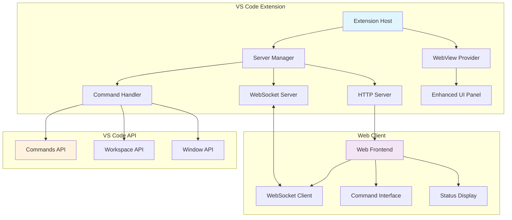

# Design Document

## Overview

The Web Automation Tunnel feature transforms the existing VS Code extension into a comprehensive remote automation platform. The system consists of three main components: an HTTP/WebSocket server for communication, a web frontend for remote control, and an enhanced VS Code extension UI for server management. The architecture leverages Node.js built-in modules for the server implementation and WebSocket protocol for real-time bidirectional communication.

## Architecture

### High-Level Architecture



### Component Interaction Flow

1. **Server Lifecycle**: Extension manages HTTP and WebSocket servers through a centralized ServerManager
2. **Command Execution**: Web clients send commands via WebSocket, processed by CommandHandler, executed via VS Code API
3. **State Synchronization**: VS Code state changes broadcast to all connected web clients
4. **UI Updates**: Extension webview reflects server status and provides control interface

## Components and Interfaces

### ServerManager Class

**Purpose**: Central orchestrator for HTTP and WebSocket servers

**Key Methods**:
- `startServer(config: ServerConfig): Promise<void>` - Initialize and start both servers
- `stopServer(): Promise<void>` - Gracefully shutdown servers
- `getServerStatus(): ServerStatus` - Return current server state and connection info
- `broadcastToClients(message: any): void` - Send message to all connected WebSocket clients

**Configuration Interface**:
```typescript
interface ServerConfig {
    httpPort: number;
    websocketPort?: number; // Optional, defaults to httpPort + 1
    allowedOrigins: string[];
    maxConnections: number;
    enableCors: boolean;
}
```

### WebSocketHandler Class

**Purpose**: Manages WebSocket connections and message routing

**Key Methods**:
- `handleConnection(ws: WebSocket): void` - Process new client connections
- `handleMessage(ws: WebSocket, message: string): void` - Route incoming messages
- `broadcastMessage(message: any): void` - Send to all connected clients
- `validateCommand(command: any): boolean` - Ensure command safety and validity

**Message Protocol**:
```typescript
interface WebSocketMessage {
    type: 'command' | 'response' | 'broadcast' | 'status';
    id?: string; // For request/response correlation
    command?: string; // VS Code command name
    args?: any[]; // Command arguments
    data?: any; // Message payload
    error?: string; // Error information
}
```

### CommandHandler Class

**Purpose**: Executes VS Code commands and manages state synchronization

**Key Methods**:
- `executeCommand(command: string, args?: any[]): Promise<any>` - Execute VS Code command safely
- `getWorkspaceState(): WorkspaceState` - Collect current workspace information
- `getEditorState(): EditorState` - Get active editor details
- `subscribeToChanges(): void` - Set up VS Code event listeners

### Enhanced WebView Provider

**Purpose**: Extends existing WebviewProvider with server management UI

**New Features**:
- Server start/stop controls with visual feedback
- Real-time server status indicators (running/stopped/error states)
- Connection count and client information display
- Server configuration panel
- Error message display with troubleshooting hints

## Data Models

### ServerStatus Model

```typescript
interface ServerStatus {
    isRunning: boolean;
    httpPort?: number;
    websocketPort?: number;
    connectedClients: number;
    uptime?: number; // milliseconds
    lastError?: string;
    serverUrl?: string;
}
```

### WorkspaceState Model

```typescript
interface WorkspaceState {
    workspaceFolders: string[];
    activeEditor?: {
        fileName: string;
        language: string;
        lineCount: number;
        selection: {
            start: { line: number; character: number };
            end: { line: number; character: number };
        };
    };
    openEditors: string[];
    recentFiles: string[];
}
```

### ClientConnection Model

```typescript
interface ClientConnection {
    id: string;
    connectedAt: Date;
    lastActivity: Date;
    userAgent?: string;
    ipAddress?: string;
}
```

## Error Handling

### Server Startup Errors

- **Port Already in Use**: Automatically try alternative ports, notify user of final port
- **Permission Denied**: Provide clear error message with suggested solutions
- **Network Interface Issues**: Fallback to localhost binding with appropriate warnings

### WebSocket Communication Errors

- **Connection Lost**: Implement automatic reconnection with exponential backoff
- **Invalid Messages**: Log and ignore malformed messages, send error response to client
- **Command Execution Failures**: Capture VS Code API errors and return structured error responses

### Security Considerations

- **Command Validation**: Whitelist allowed VS Code commands to prevent dangerous operations
- **Origin Checking**: Validate WebSocket connections against configured allowed origins
- **Rate Limiting**: Implement per-client rate limiting to prevent abuse
- **Input Sanitization**: Validate and sanitize all incoming command arguments

## Testing Strategy

### Manual Testing Scenarios

- Server management through VS Code extension UI
- Web frontend functionality across different browsers
- Multiple concurrent client connections
- Network interruption and reconnection handling
- Configuration changes and server restart behavior

## Performance Considerations

### Memory Management

- Implement connection pooling with configurable limits
- Clean up disconnected client references promptly
- Use streaming for large data transfers (file contents, workspace info)

### Network Optimization

- Implement message compression for WebSocket communication
- Batch state updates to reduce message frequency
- Use efficient JSON serialization for large objects

### VS Code Integration

- Minimize VS Code API calls frequency to avoid performance impact
- Cache workspace state and update incrementally
- Use VS Code's built-in event system efficiently for state monitoring

### GIT MANAGEMENT

- create a branch for this tasks
- commit every tasks with proper message and description on what we doing
- setup every tasks with proper commit message and description