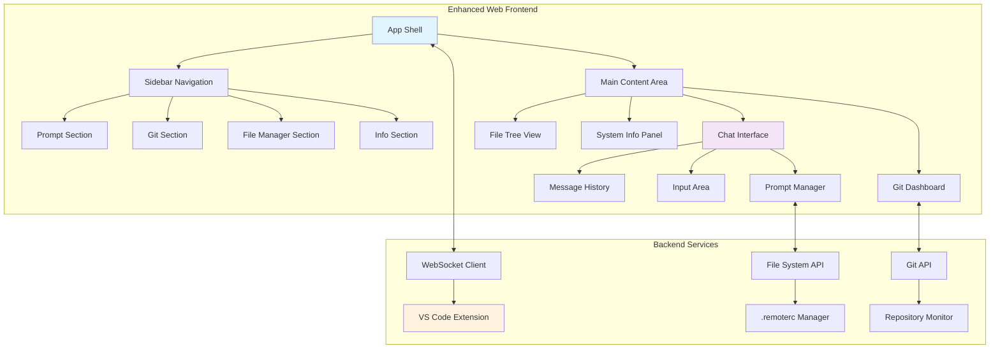

# Design Document

## Overview

The Web Frontend Enhanced UI transforms the existing basic web automation interface into a modern, chat-centric development environment. The design follows a sidebar navigation pattern with four main sections: Prompt (chat interface), Git integration, File Manager, and Info display. The core interaction shifts from command-based to conversational, with automatic prompt persistence and comprehensive development tool integration.

## Architecture

### High-Level Architecture



### Component Hierarchy

```
EnhancedWebApp
├── AppShell
│   ├── Sidebar
│   │   ├── NavigationItem (Prompt)
│   │   ├── NavigationItem (Git)
│   │   ├── NavigationItem (File Manager)
│   │   └── NavigationItem (Info)
│   └── MainContent
│       ├── ChatInterface
│       │   ├── MessageHistory
│       │   ├── MessageInput
│       │   └── PromptManager
│       ├── GitDashboard
│       │   ├── BranchInfo
│       │   ├── CommitHistory
│       │   └── DiffViewer
│       ├── FileManager
│       │   ├── FileTree
│       │   ├── FileActions
│       │   └── FilePreview
│       └── InfoPanel
│           ├── ServerStatus
│           ├── ConnectionInfo
│           └── SystemMetrics
```

## Components and Interfaces

### App Shell Component

**Purpose**: Main application container managing layout and navigation state

**Key Features**:
- Responsive sidebar toggle for mobile devices
- Global state management for active section
- Theme integration with VS Code color scheme
- Real-time connection status indicator

**State Interface**:
```typescript
interface AppShellState {
    activeSection: 'prompt' | 'git' | 'files' | 'info';
    sidebarCollapsed: boolean;
    connectionStatus: 'connected' | 'connecting' | 'disconnected';
    theme: 'dark' | 'light';
}
```

### Chat Interface Component

**Purpose**: Conversational prompt interface with message history

**Key Features**:
- Top-to-bottom message flow with auto-scroll
- Message type distinction (user/system/error)
- Rich text formatting for code blocks and syntax highlighting
- Typing indicators and message status
- Message timestamps and metadata

**Message Interface**:
```typescript
interface ChatMessage {
    id: string;
    type: 'user' | 'system' | 'error' | 'info';
    content: string;
    timestamp: Date;
    metadata?: {
        promptFile?: string;
        executionTime?: number;
        commandExecuted?: string;
    };
}
```

### Prompt Manager Component

**Purpose**: Manages prompt history, categorization, and file persistence

**Key Features**:
- Automatic prompt saving to `.remoterc` folder
- Prompt categorization and tagging system
- Search and filter functionality
- Quick prompt templates and favorites
- Export/import prompt collections

**Prompt Interface**:
```typescript
interface PromptRecord {
    id: string;
    content: string;
    timestamp: Date;
    category?: string;
    tags: string[];
    filePath: string;
    favorite: boolean;
    executionCount: number;
    lastUsed?: Date;
}
```

### Git Dashboard Component

**Purpose**: Comprehensive git status and history visualization

**Key Features**:
- Current branch and status display
- Recent commits in card-based layout
- Interactive diff viewer with syntax highlighting
- Staging area visualization
- Branch switching and basic git operations

**Git State Interface**:
```typescript
interface GitState {
    currentBranch: string;
    status: {
        staged: string[];
        unstaged: string[];
        untracked: string[];
        conflicted: string[];
    };
    recentCommits: GitCommit[];
    currentDiff: GitDiff[];
    remoteStatus: {
        ahead: number;
        behind: number;
        remote: string;
    };
}

interface GitCommit {
    hash: string;
    message: string;
    author: string;
    date: Date;
    files: string[];
}

interface GitDiff {
    file: string;
    type: 'added' | 'modified' | 'deleted';
    additions: number;
    deletions: number;
    content: string;
}
```

### File Manager Component

**Purpose**: Interactive workspace file browser with VS Code integration

**Key Features**:
- Hierarchical file tree with expand/collapse
- File type icons and metadata display
- Click-to-open integration with VS Code
- Real-time file system monitoring
- File search and filtering
- Context menu for file operations

**File Tree Interface**:
```typescript
interface FileNode {
    name: string;
    path: string;
    type: 'file' | 'directory';
    size?: number;
    modified?: Date;
    children?: FileNode[];
    expanded?: boolean;
    icon?: string;
    language?: string;
}

interface FileSystemState {
    rootNodes: FileNode[];
    selectedFile?: string;
    expandedPaths: Set<string>;
    searchQuery?: string;
    filteredNodes?: FileNode[];
}
```

### Info Panel Component

**Purpose**: System information and server status display

**Key Features**:
- Real-time server status and metrics
- Connection information and client count
- Extension version and configuration
- Performance metrics and health indicators
- Error logs and troubleshooting information

## Data Models

### Enhanced WebSocket Message Protocol

```typescript
interface EnhancedWebSocketMessage extends WebSocketMessage {
    // Additional message types for enhanced UI
    type: 'command' | 'response' | 'broadcast' | 'status' | 
          'prompt' | 'git' | 'fileSystem' | 'config';
    
    // Enhanced data payloads
    data?: {
        // Prompt-specific data
        promptData?: {
            content: string;
            category?: string;
            tags?: string[];
        };
        
        // Git-specific data
        gitData?: {
            operation: 'status' | 'log' | 'diff' | 'branch';
            result: any;
        };
        
        // File system data
        fileSystemData?: {
            operation: 'tree' | 'open' | 'watch';
            path?: string;
            content?: FileNode[];
        };
        
        // Configuration data
        configData?: {
            key: string;
            value: any;
            schema?: any;
        };
    };
}
```

### Prompt Persistence Model

```typescript
interface PromptFile {
    filename: string; // Format: YYYY-MM-DD_HH-mm-ss_prompt.md
    content: string;
    metadata: {
        timestamp: Date;
        category?: string;
        tags: string[];
        executionResult?: string;
        responseTime?: number;
    };
}

interface RemoteRCStructure {
    prompts: {
        [date: string]: PromptFile[]; // Organized by date folders
    };
    categories: {
        [category: string]: string[]; // Category to prompt file mapping
    };
    config: {
        defaultCategory: string;
        autoSave: boolean;
        maxHistoryDays: number;
    };
}
```

### UI State Management

```typescript
interface GlobalUIState {
    // Navigation state
    navigation: {
        activeSection: string;
        sidebarCollapsed: boolean;
        previousSection?: string;
    };
    
    // Chat state
    chat: {
        messages: ChatMessage[];
        inputValue: string;
        isTyping: boolean;
        scrollPosition: number;
    };
    
    // Git state
    git: GitState;
    
    // File system state
    fileSystem: FileSystemState;
    
    // Connection state
    connection: {
        status: 'connected' | 'connecting' | 'disconnected';
        lastConnected?: Date;
        reconnectAttempts: number;
        latency?: number;
    };
    
    // UI preferences
    preferences: {
        theme: 'dark' | 'light';
        fontSize: number;
        compactMode: boolean;
        animations: boolean;
    };
}
```

## Error Handling

### Connection Error Recovery

- **WebSocket Disconnection**: Implement exponential backoff reconnection with visual feedback
- **Message Queue**: Queue messages during disconnection and replay on reconnection
- **Offline Mode**: Provide limited functionality when disconnected (prompt history, cached git data)

### File System Error Handling

- **Permission Errors**: Graceful handling of file access issues with user-friendly messages
- **Path Resolution**: Robust path handling across different operating systems
- **File Watching**: Fallback mechanisms when file system watching fails

### Git Integration Errors

- **Repository Detection**: Handle cases where workspace is not a git repository
- **Git Command Failures**: Provide meaningful error messages for git operation failures
- **Merge Conflicts**: Visual indication and guidance for conflict resolution

## Performance Considerations

### Virtual Scrolling

- Implement virtual scrolling for chat messages and file trees to handle large datasets
- Lazy loading of git history and file content
- Efficient DOM updates using virtual DOM or similar techniques

### Real-time Updates

- Debounce file system changes to prevent excessive updates
- Throttle git status checks to balance responsiveness and performance
- Implement efficient diff algorithms for large files

### Memory Management

- Automatic cleanup of old chat messages beyond configurable limit
- Efficient caching strategies for file tree and git data
- Proper disposal of event listeners and subscriptions

## Security Considerations

### Input Validation

- Sanitize all user input before sending to VS Code
- Validate file paths to prevent directory traversal attacks
- Implement command whitelist for VS Code operations

### File System Access

- Restrict file operations to workspace boundaries
- Validate `.remoterc` folder creation and access permissions
- Implement safe file naming conventions for prompt files

## Testing Strategy

### Manual Testing Approach

Following the project's testing guidelines, focus on comprehensive manual testing:

1. **Cross-browser Compatibility**
   - Test on Chrome, Firefox, Safari, and Edge
   - Verify responsive design on different screen sizes
   - Test WebSocket connectivity across browsers

3. **Error Scenario Testing**
   - Test behavior during network disconnections
   - Verify error handling for invalid git repositories
   - Test file system permission errors
   - Validate graceful degradation when VS Code is unavailable


## Implementation Phases

### Phase 1: Core Infrastructure
- App shell and navigation framework
- Basic chat interface with message display
- WebSocket integration for enhanced message protocol

### Phase 2: Prompt Management
- Chat input and message handling
- `.remoterc` folder creation and file persistence
- Basic prompt history and search

### Phase 3: Git Integration
- Git status display and branch information
- Commit history visualization
- Basic diff viewer implementation

### Phase 4: File Manager
- File tree display and navigation
- VS Code integration for file opening
- Real-time file system monitoring

### Phase 5: Polish and Enhancement
- Advanced prompt categorization and tagging
- Enhanced git operations and diff viewing
- Performance optimizations and error handling
- Responsive design and accessibility improvements

### GIT MANAGEMENT

- create a branch for this tasks
- commit every tasks with proper message and description on what we doing
- setup every tasks with proper commit message and description