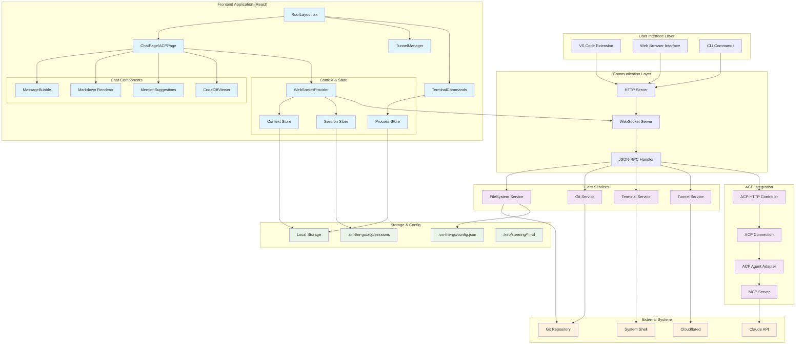
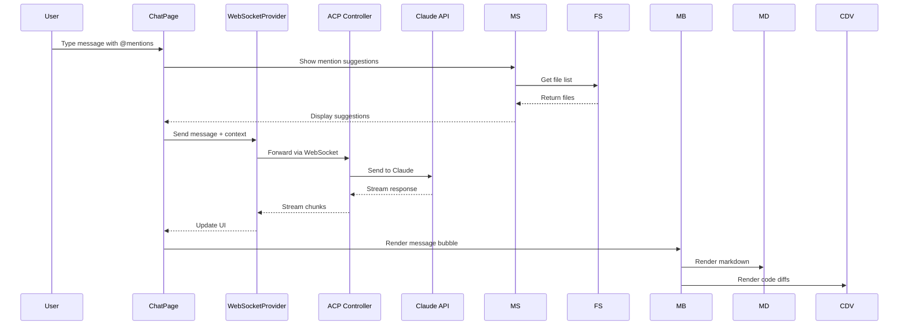
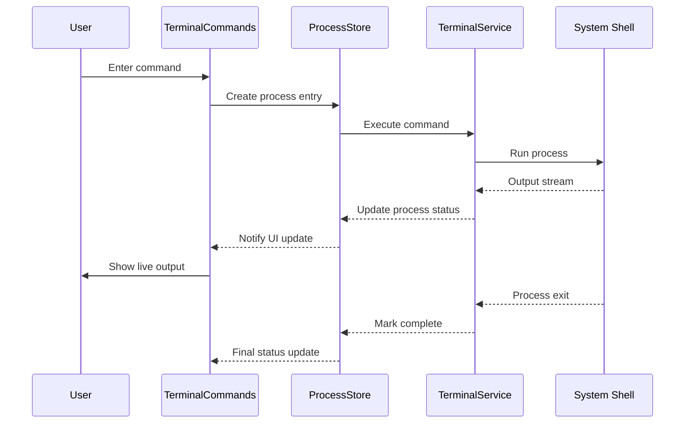
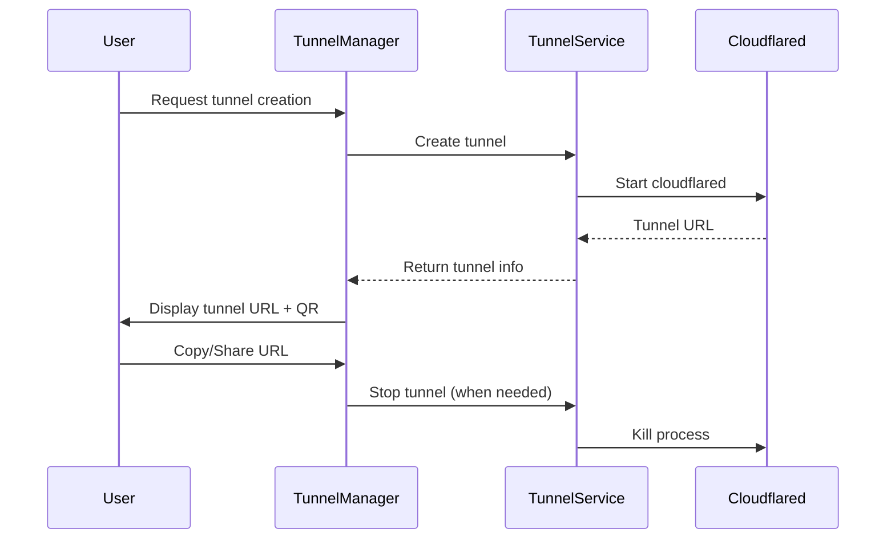
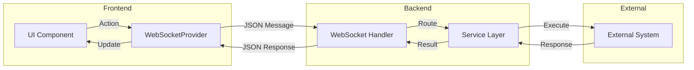
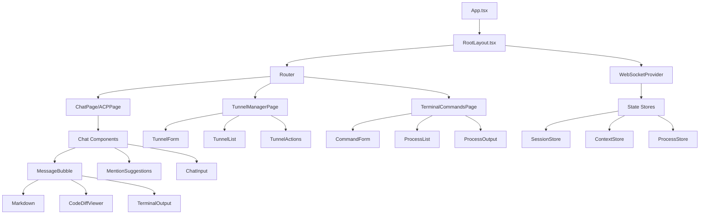
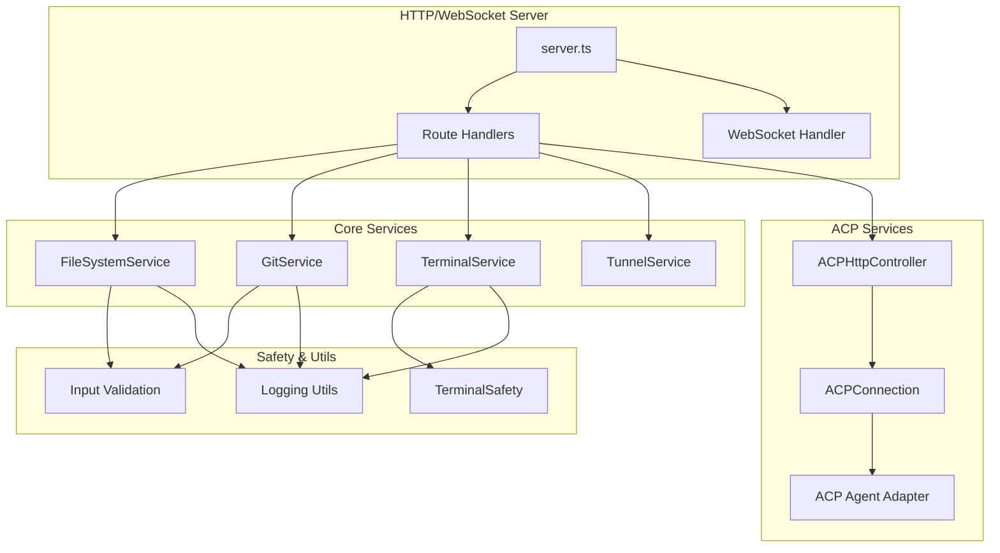
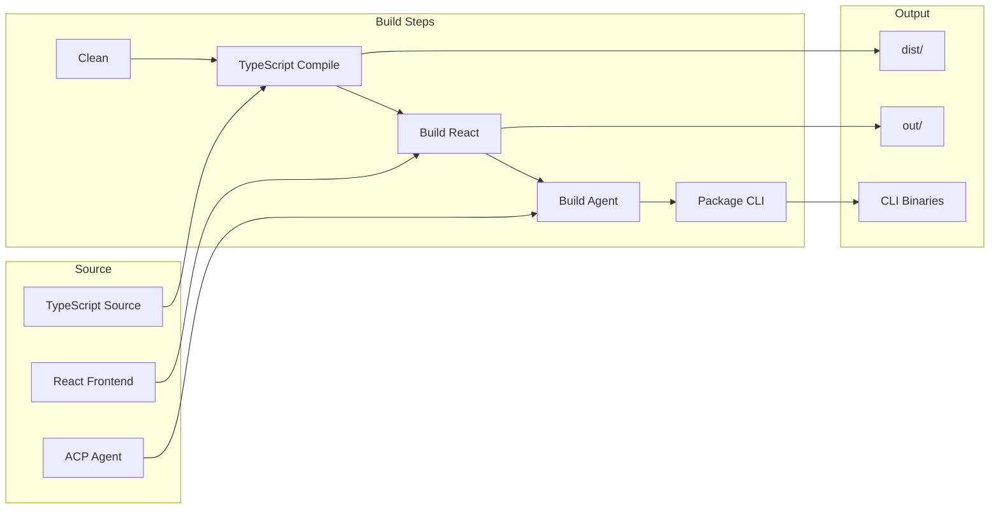

# COTG-CLI System Architecture Diagram

## Complete System Overview



## Feature-Specific Component Flow

### 1. Chat/ACP Feature Flow


### 2. Terminal Commands Feature Flow


### 3. Tunnel Management Feature Flow


## Data Flow Architecture

### WebSocket Message Flow


### File System Integration
```mermaid
graph TB
    subgraph "File Operations"
        READ[Read Files]
        WRITE[Write Files]
        WATCH[Watch Changes]
        DIFF[Generate Diffs]
    end
    
    subgraph "Git Integration"
        STATUS[Git Status]
        COMMIT[Git Commit]
        BRANCH[Branch Ops]
        HISTORY[Git History]
    end
    
    subgraph "Context Management"
        MENTIONS[@file Mentions]
        ATTACH[File Attachments]
        PREVIEW[File Preview]
        SEARCH[File Search]
    end
    
    READ --> MENTIONS
    WATCH --> STATUS
    DIFF --> ATTACH
    STATUS --> PREVIEW
    COMMIT --> HISTORY
    BRANCH --> CONTEXT
    SEARCH --> MENTIONS
```

## Component Hierarchy

### React Component Tree


## Service Layer Architecture

### Backend Services


## Build & Deployment Flow

### Build Process


This architecture diagram shows how cotg-cli integrates multiple development tools into a cohesive web-based IDE experience, with clear separation between frontend UI, backend services, and external integrations.