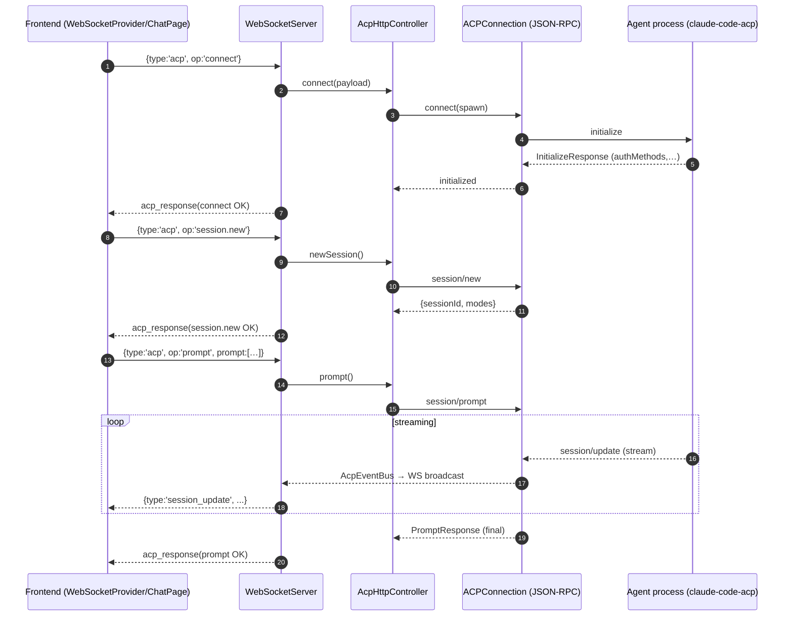

# ACP lifecycle (backend + frontend)

This document explains how ACP (Agent Client Protocol) is started, how it communicates, and how reconnect/recovery are handled across the backend and frontend. It also lists the important files and functions involved.

---

## High-level architecture

- Backend boots an HTTP server to serve the React app and attaches a WebSocket server at `/ws` for app RPC.
- The frontend connects via WebSocket using an auto-reconnecting client.
- All ACP actions are performed over WebSocket messages of type `"acp"` using request/response correlation (`id` + `acp_response`).
- On-demand, the backend spawns the ACP agent process (Claude Code ACP by default) and communicates with it over stdio using JSON-RPC framing (LSP or NDJSON depending on adapter).
- Streaming updates/events from the agent are bridged to all connected WS clients via a global `AcpEventBus`.

---

## Backend lifecycle

Backend responsibilities live in the following modules:

- `src/cli/server.ts` — bootstraps servers and registers WebSocket services (including `acp`).
- `src/server/HttpServer.ts` — serves the frontend bundle and handles CORS/security headers.
- `src/server/WebSocketServer.ts` — manages WS connections, routing, heartbeat, message envelopes.
- `src/acp/AcpHttpController.ts` — ACP façade that spawns/manages the agent process and translates app operations to JSON-RPC calls.
- `src/acp/ACPConnection.ts` — JSON-RPC over stdio client to the agent process (spawn/initialize/requests/notifications).
- `src/acp/jsonrpc.ts` — low-level JSON-RPC framing (LSP or NDJSON) and message router.
- `src/acp/AcpEventBus.ts` — global `EventEmitter` used to broadcast ACP events to all WS clients.
- Persistence stores: `src/acp/SessionsStore.ts`, `src/acp/ThreadsStore.ts`, `src/acp/ModesStore.ts`.

### Server startup

- `CliServer.start()` (`src/cli/server.ts`)
  - Starts `HttpServer` (serves React `dist/`).
  - Attaches `WebSocketServer` to the HTTP server (`/ws`).
  - Instantiates and initializes `AcpHttpController` (no agent process yet).
  - Registers WebSocket services:
    - `terminal`, `git`, `fileSystem`, `tunnels`.
    - `acp` — the ACP service entrypoint.
  - Bridges `AcpEventBus` to WS broadcast so all ACP events reach clients.

### WebSocket service routing

- `WebSocketServer` (`src/server/WebSocketServer.ts`)
  - On connection, sends a `connection_established` frame: `{ type, connectionId, timestamp, supportsAcpRequests: true }`.
  - Routes incoming frames by `message.type`.
  - For ACP:
    - Incoming: `{ type: 'acp', id, op, payload }`.
    - Dispatches to `AcpHttpController` based on `op`.
    - Outgoing reply: `{ type: 'acp_response', id, ok, result | error }`.
    - Preserves structured errors (e.g., `code`, `authRequired`, `authMethods`).
  - Heartbeats:
    - Server pings every 30s (`ws.ping()`); marks connection dead if no pong/app messages.
    - Marks connection alive on any app message to tolerate proxies that might drop protocol pongs.

### ACP connection lifecycle

- `AcpHttpController.connect(body)` (`src/acp/AcpHttpController.ts`)
  - Validates request and resolves the agent command:
    - Defaults to local `claude-code-acp/dist/index.js` or `node_modules/@zed-industries/claude-code-acp/dist/index.js` run by `node`.
    - Falls back to `npx -y @zed-industries/claude-code-acp`.
    - Env var controls:
      - `KIRO_PREFER_LOCAL_AGENT=1` — prefer local clone over node_modules.
      - `KIRO_ALLOW_ANY_AGENT_CMD=1` — allow non-default `agentCmd`.
      - `proxy` in body also injected into env as `HTTPS_PROXY`/`HTTP_PROXY`.
  - Idempotent connect: if already connected and initialized, returns previous `init` without respawning (reason `reuse_existing`).
  - Otherwise, constructs a fresh `ACPConnection` and wires events → `AcpEventBus`:
    - `session_update`, `permission_request`, `agent_stderr`, `agent_exit`, `agent_initialized`, `terminal_output`, `terminal_exit`.
  - Calls `ACPConnection.connect({ path, args, cwd, env })`:
    - Spawns the agent process (no shell on Windows, preserves spaces in paths).
    - Selects framing: NDJSON for Claude, LSP otherwise.
    - Installs JSON-RPC listeners (`session/update`, `session/request_permission`, terminals, fs read/write).
    - Sends `initialize` and returns `InitializeResponse`.

- `ACPConnection` (`src/acp/ACPConnection.ts`)
  - `connect()` — spawn + JSON-RPC handshake. Emits `initialized` and debug `rpc_debug` events.
  - `newSession({ cwd, mcpServers })` — JSON-RPC `session/new`.
  - `prompt(req)` — JSON-RPC `session/prompt` with adapter-specific payload shape.
  - `cancel(sessionId)` — JSON-RPC `session/cancel` notification.
  - `respondPermission(requestId, outcome, optionId?)` — answers permission requests.
  - `setMode`, `listModels`, `selectModel` — session/mode/model management.
  - Terminal helpers for agent-initiated tools and UI:
    - RPC handlers: `terminal/create`, `terminal/output`, `terminal/kill`, `terminal/release`, `terminal/wait_for_exit`.
    - Public methods mirror them for UI-initiated terminals.

### Sessions, threads, and modes persistence

- `AcpHttpController.init()` restores `lastSessionId` and `modes` snapshot from disk under `.on-the-go/acp/`.
- On `newSession()`/`prompt()`, stores metadata using:
  - `SessionsStore` (`sessions.json`): last session and list with timestamps.
  - `ThreadsStore` (`threads/<id>.json` + `threads/index.json`): append `session_update`s for history and derive titles.
  - `ModesStore` (`modes/<id>.json`): snapshot available modes and current mode id; update on `setMode` and mode updates.

### Recovery and reconnection (backend)

- WS-level: handled by `WebSocketServer` heartbeats; dead connections are terminated.
- ACP agent session recovery: `AcpHttpController.prompt()` handles “Session not found” errors from the agent by:
  - Creating a new session (`conn.newSession`), updating persistence, and emitting `session_recovered` with `{ oldSessionId, newSessionId }` via `AcpEventBus`.
  - Retrying the prompt once on the new session.
- Agent process lifecycle:
  - On agent exit, `agent_exit` is emitted (bridged to clients). There’s no automatic respawn; clients can issue a new `connect`.

---

## Frontend lifecycle

Frontend responsibilities live primarily in:

- `src/webview/react-frontend/src/components/WebSocketProvider.tsx` — connection, reconnection, and ACP request/response helper.
- Chat UIs: `src/webview/react-frontend/src/pages/ChatPage.tsx` and `src/webview/react-frontend/src/pages/ACPPage.tsx`.

### WebSocket connection and reconnection

- `WebSocketProvider` uses `reconnecting-websocket` to connect to `ws(s)://<host>/ws`.
  - Auto-retry: min 1s → max 10s backoff, up to 50 retries.
  - On `open`, sets `isConnected`; on `close`, clears counters.
  - Receives `connection_established` to set `supportsAcpRequests` and increment `connectionCount`.
  - Application heartbeat: sends `{ type: 'ping', ts }` every 20s to keep paths warm across proxies.
  - Debug toggles via `localStorage`: `KIRO_DEBUG_WS=1`, `KIRO_DEBUG_TERMINAL_CLIENT=1`.

### ACP request/response envelope (frontend)

- `sendAcp(op, payload?, { timeoutMs? })` in `WebSocketProvider`:
  - Sends `{ type: 'acp', id, op, payload }`.
  - Waits for a matching `{ type: 'acp_response', id }`.
  - Unwraps common `{ success, data }` envelope if present.
  - Resolves with `result`, or rejects with an `Error(message)` extended with `code` when provided.
  - Default timeout 15s (min 1s, max 60s).

### Streaming events (frontend)

- Any event broadcast on `AcpEventBus` is forwarded by the backend to all WS clients and handled in UI:
  - `session_update` — incrementally rendered as chat messages.
  - `permission_request` — opens a modal with choices; on selection the UI calls `sendAcp('permission', ...)`.
  - `agent_initialized`, `agent_connect`, `agent_exit` — surfaced in logs.
  - `session_recovered` — clients adopt the `newSessionId` and refresh context.
  - `terminal_output`, `terminal_exit` — terminal panes or message blocks.

### Chat flows

- `ChatPage.tsx`
  - On first WS connection, runs `safeConnect()` → `sendAcp('connect', {})`.
  - Restores last active thread and session state via:
    - `sendAcp('session.selectThread', { threadId })` to adopt the backend’s active session.
    - `sendAcp('session.state', {})` as fallback to recover `sessionId` and `modes`.
  - Sending a prompt:
    - Locally echoes the user message for responsiveness.
    - Calls `sendAcp('prompt', { prompt })`.
    - On errors like “not connected”, auto-calls `sendAcp('connect', {})` then retries.
    - On “Session not found”, the backend may emit `session_recovered`, which the UI listens for and adopts.
  - Modes/Models:
    - `sendAcp('session.setMode', ...)`, `sendAcp('models.list', ...)`, `sendAcp('model.select', ...)`.

- `ACPPage.tsx`
  - A more explicit ACP console (connect/new session/prompt), useful for debugging.
  - Similar recovery: after “Session not found” it requests a new session and retries once.

---

## Message contracts

- Connect
  - Request: `{ type: 'acp', id, op: 'connect', payload: { agentCmd?, cwd?, env?, proxy? } }`
  - Response: `{ type: 'acp_response', id, ok: true, result: { ok: true, init, debug? } }`

- New session
  - Request: `{ type: 'acp', id, op: 'session.new', payload: { cwd?, mcpServers? } }`
  - Response: `{ type: 'acp_response', id, ok: true, result: { sessionId, modes? } }`

- Prompt
  - Request: `{ type: 'acp', id, op: 'prompt', payload: { sessionId?, prompt: ContentBlock[] } }`
    - Backend ignores provided `sessionId` and uses the active session (`ensureActiveSession()`).
  - Response: `{ type: 'acp_response', id, ok: true, result: PromptResponse }`
  - Streaming: separate `session_update` events during/after prompt.

- Permission
  - Event from backend: `{ type: 'permission_request', requestId, request }`
  - UI action: `{ type: 'acp', id, op: 'permission', payload: { requestId, outcome: 'selected'|'cancelled', optionId? } }`

- Session state helpers
  - `session.state` → `{ connected: boolean; sessionId: string | null; modes?: any }`
  - `sessions.list` → `{ sessions: Array<{ id, title?, createdAt, updatedAt }>, lastSessionId }`
  - `session.selectThread` → `{ ok: true, sessionId, modes? }`

- Terminals (ACP controller passthrough)
  - `terminal.create` → `{ terminalId }`
  - `terminal.output` → `{ output, truncated, exitStatus }`
  - `terminal.kill`, `terminal.release`, `terminal.waitForExit`

## Authentication

Authentication support is adapter-specific and surfaced via `authMethods` on initialize. The frontend can query and display available methods and attempt authentication.

- WS ops (see `src/cli/server.ts` → ACP service routing):
  - `authMethods` → `{ methods: Array<{ id: string; name: string; description?: string }> }`
  - `authenticate` → `{ ok: true }` on success, or a structured error.

- Backend (`src/acp/AcpHttpController.ts`):
  - `getAuthMethods()` returns `conn.getInitializeInfo()?.authMethods`.
  - `authenticate({ methodId })` forwards to `ACPConnection.authenticate(methodId)` which calls agent JSON-RPC `authenticate`.
  - `authMapError(err)` maps provider auth errors to a structured error with:
    - `code: 401`, `authRequired: true`, `authMethods: [...]`.
    - This is preserved by `src/cli/server.ts` and delivered to clients.

- Claude adapter specifics (`claude-code-acp`):
  - Initialize advertises one method:
    - `{ id: 'claude-login', name: 'Log in with Claude Code', description: 'Run `claude /login` in the terminal' }` (see `claude-code-acp/dist/acp-agent.js`).
  - The agent’s `authenticate` RPC is currently not implemented and will error if invoked.
  - When not logged in, the agent throws an auth-required error in several places, e.g.:
    - On `newSession()` if certain config files are missing.
    - During `prompt()` when the SDK instructs “Please run /login”.
  - The correct flow is to run the CLI login once:
    1) Open a terminal on your machine (or use the in-app terminal via `terminal.create`).
    2) Run: `claude /login` and follow the instructions.
    3) Back in the app, click Connect or create a new session and retry your action.

- Frontend (`src/webview/react-frontend/src/pages/ACPPage.tsx`):
  - Calls `authMethods` on `agent_initialized` and stores `authMethods`.
  - Provides an Authenticate button that sends `authenticate({ methodId })`.
  - For Claude, this is a no-op today; users should perform the terminal login flow above.
  - On receiving `{ authRequired: true }` errors, the UI shows a hint with the available method names.

---

## Important implementations (by file/function)

- `src/cli/server.ts`
  - `CliServer.start()` — boot, service registration, `AcpEventBus` → WS bridge.
  - WS service `acp` — maps operations to `AcpHttpController` (`connect`, `prompt`, `session.new`, `session.state`, `permission`, etc.).

- `src/server/WebSocketServer.ts`
  - `start()` — attaches upgrade handler to HTTP server on `/ws`.
  - `handleMessage()` — routes frames; builds `acp_response` envelope; heartbeats; debug logging.

- `src/acp/AcpHttpController.ts`
  - `connect()` — resolve agent cmd, spawn via `ACPConnection`, wire events → `AcpEventBus`.
  - `newSession()`, `prompt()` — maintain `lastSessionId`, update stores; automatic session recovery on “Session not found”.
  - `setMode()`, `cancel()`, `listModels()`, `selectModel()`.
  - `permission()` — forwards to `ACPConnection.respondPermission()`.
  - `state()`, `selectThread()`, `sessions.list/last`, `session.select/delete`.
  - `applyDiff()` — safe write helper exposed over WS as `diff.apply`.

- `src/acp/ACPConnection.ts`
  - `connect()` — spawn + JSON-RPC, framing selection (`ndjson` for Claude, `lsp` for generic).
  - JSON-RPC handlers for `session/update`, `session/request_permission`, terminals, fs read/write.
  - Adapter-specific payload normalization for `prompt`, `cancel`, `setMode` (camelCase vs snake_case).

- `src/acp/jsonrpc.ts`
  - Dual framing parser: LSP (`Content-Length`) and NDJSON (line-delimited JSON) with events:
    - `outgoing_request`, `outgoing_notification`, `incoming_response`, `request`, `notification`.

- `src/acp/SessionsStore.ts`, `src/acp/ThreadsStore.ts`, `src/acp/ModesStore.ts`
  - Disk-backed lightweight stores for restoring UI state and chat history.

- `src/webview/react-frontend/src/components/WebSocketProvider.tsx`
  - `sendAcp()` — ACP RPC helper with correlation and timeouts.
  - Reconnection and heartbeat logic; WS debug logging; event fan-out to listeners.

- `src/webview/react-frontend/src/pages/ChatPage.tsx`
  - Auto-connect, restore last thread, map `session_update` to rendered chat, adopt `session_recovered`.

- `src/webview/react-frontend/src/pages/ACPPage.tsx`
  - Manual-connect console; mirrors flows in a more explicit UI for diagnostics.

---

## Reconnect/recovery matrix

- __WS disconnect__
  - Handled by `reconnecting-websocket` on the client, with progressive backoff.
  - Backend pings and terminates dead sockets, but any app message also marks the connection alive.

- __ACP agent exits__
  - Backend emits `agent_exit` (bridged to clients). No auto-respawn. Users can trigger `connect` again.

- __Agent session missing__
  - Backend `prompt()` transparently creates a new session, emits `session_recovered`, and retries once.
  - Frontend listens to `session_recovered` and updates `sessionId`/thread selection.

- __Not connected errors__
  - Chat UIs attempt a `connect` call and then retry the failed operation.

---

## Environment controls

- `KIRO_PREFER_LOCAL_AGENT=1` — prefer local `claude-code-acp` clone (in repo) over node_modules.
- `KIRO_ALLOW_ANY_AGENT_CMD=1` — accept arbitrary `agentCmd` via `connect`.
- `KIRO_WS_ALLOW_ANY_ORIGIN=1` — relax WS origin allowlist (dev convenience).
- `KIRO_GIT_DEBUG=1` — verbose Git service logs.
- Frontend `localStorage` toggles: `KIRO_DEBUG_WS=1`, `KIRO_DEBUG_TERMINAL_CLIENT=1`.

---

## Smoke test (WS-first)

- `scripts/smoke-acp-ws.js` demonstrates the wire protocol over WebSocket only:
  - Opens `ws://localhost:<port>/ws`.
  - Waits for `connection_established`.
  - Sends ACP ops (`connect`, `session.new`, `prompt`) as `{ type: 'acp', id, op, payload }`.
  - Waits for `{ type: 'acp_response', id }`.
  - Streams `session_update` and related events are printed opportunistically.

Run:

```bash
BASE_URL=http://localhost:3900 ANTHROPIC_API_KEY=... node scripts/smoke-acp-ws.js
```

---

## Adapter specifics (Claude vs generic)

- `ACPConnection` auto-detects Claude Code agent by matching `agentCmd` path/args containing `claude-code-acp`:
  - Sets framing to `ndjson`.
  - Uses adapter `'claude'` and normalizes payloads for `prompt`, `cancel`, `setMode`.
  - `supportsModelListing()` returns `false` for Claude (no model picker).

---

## Typical end-to-end flow

1. Frontend loads and connects WS → receives `connection_established`.
2. Frontend calls `sendAcp('connect', { env?: { ANTHROPIC_API_KEY } })`.
3. Backend spawns agent and returns `InitializeResponse`; events: `agent_connect`/`agent_initialized`.
4. Frontend calls `sendAcp('session.new', { cwd? })`; backend persists `lastSessionId` and `modes`.
5. Frontend calls `sendAcp('prompt', { prompt: ContentBlock[] })`.
6. Agent streams updates; backend emits `session_update` events via `AcpEventBus` → WS broadcast → UI renders.
7. If a tool requires permissions, backend emits `permission_request`; UI responds via `sendAcp('permission', ...)`.
8. On WS drop, client auto-reconnects; on agent exit, UI triggers `connect` again.
9. If agent reports missing session, backend transparently creates a new session and emits `session_recovered`.

## Sequence diagram: connect → prompt → streaming



---

## Notes and gotchas

- `connect()` is idempotent in `AcpHttpController`; if the controller still thinks it is connected, it will return existing `init`.
- The backend emits rich debug logs for WS frames and terminal traffic when debug flags are enabled.
- The UI locally echoes user messages before the agent replies to keep the chat responsive.
